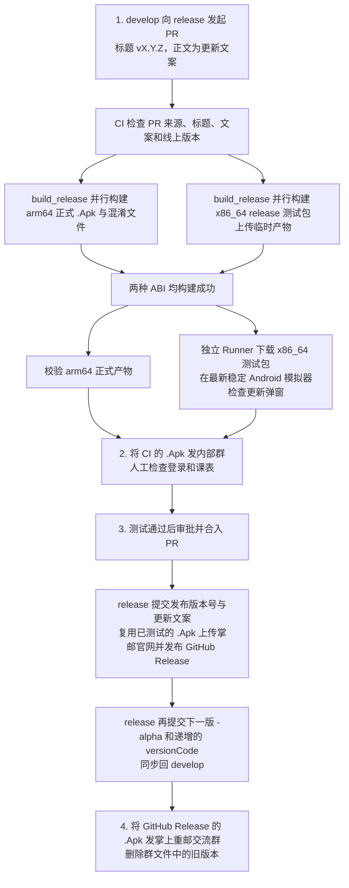

# Android 自动发版

## 发版者先看

1. 将 `develop` 分支向 `release` 分支发起 PR，标题必须为 `vX.Y.Z`，正文填写新版本的更新文案。
2. 发版检查和打包完成后，将 CI 的 `.Apk` 产物发到内部群做最后一次测试，重点检查能否登录、能否查看课表。
3. 内部测试通过后审批并合入 PR；CI 会自动修改版本、发布 GitHub Release，并将下一版版本号同步回 `develop`。
4. 将 GitHub Release 上传的 `.Apk` 发到**掌上重邮交流群**，并删除群文件中的旧版本。

> 版本号 `X.Y.Z` 规则：`X` 是大版本，仅在涉及较大 UI 改动时加 1；`Y` 在新需求合入时加 1；`Z` 在对应 `Y` 版本的 bugfix 发版时加 1。

## 流程图

PR 检查失败时不会提交版本文件。合并后的任一步失败都会停止后续步骤，并保留已经成功的提交或外部发布结果；按下文的重跑规则处理。

## PR 阶段：候选版本与七项检查

入口是 `.github/workflows/android-release.yml`。来源、标题、文案、版本四项检查依次执行；版本检查通过后，`build_release` 的矩阵在两个独立 Runner 并行构建 arm64 和 x86_64 release 包。两种 ABI 都成功后，`check_artifact` 与 `check_update_dialog` 在新的 Runner 分别下载正式包和测试包进行检查。仍保留七项必需检查名，另外显示两个 ABI 的具体构建结果；任一构建失败或跳过，名为 `build_release` 的汇总检查会失败，不能合入。工作流中的检查错误会输出中文提示。

完整通过时共执行 9 个 `ubuntu-latest` Runner 任务，最多并发 2 个；同一个 job 内步骤顺序执行。两个构建 Runner 各自安装 `requests`，再生成签名文件，避免独立 Python 环境缺少依赖。模拟器运行在 `check_update_dialog` Runner 内，不额外分配一个 Runner。合并后的 `publish` 使用另一台 Runner 顺序执行发布与同步。

| Job | 调用与通过条件 |
| --- | --- |
| `check_source` | 来源必须是本仓库的 `develop`，不能来自 fork，也不能是草稿 PR。 |
| `check_title` | 标题必须完全符合 `vX.Y.Z`，三个位置均为数字。 |
| `check_notes` | PR 正文去掉首尾空白后为 30～20000 个字符。 |
| `check_version` | `prepare_release_candidate.sh` 调用 `release_version.py online` 无令牌读取 `https://app.redrock.team/cyxbsAppUpdate.json`，再调用 `prepare`。线上 `version_code` 必须是正整数；候选 `versionCode = 线上 code + 1`，且不能达到 Android 版本号上限。若线上 `version_name` 是合法 `X.Y.Z`，PR 标题版本必须严格更高；若线上名字非法，发出警告并允许以 PR 标题覆盖。`gradle.properties` 中两个版本键必须各出现一次，但**不比较 develop 当前的数值**。最后运行 `tests/` 中的 Python 回归测试，并输出线上快照、候选元数据和 release 基线供两个构建 job 共用。 |
| `build_release` | 矩阵并行运行 `arm64-v8a` 和 `x86_64`，共用 `prepare_release_candidate.sh --reuse-checked` 注入的版本快照和 PR 文案；只允许 CI 工作区中的版本号、文案因注入而变化。两个 Runner 分别生成签名文件。arm64 执行 `:cyxbs-applications:pro:channelRelease`，要求唯一 official APK 和非空 mapping，保存正式包、版本元数据、基线、来源 SHA、文案及 SHA256；正式文件为 `CyxbsMobile-vX.Y.Z-code.Apk`、`proguardMapping-vX.Y.Z-code.txt`。x86_64 执行 `:cyxbs-applications:pro:assembleRelease -Pcyxbs.ciReleaseX86_64=true`，上传仅供后续 Runner 使用的 `android-release-ui-test-提交SHA`，保留一天，包含 APK、版本、文案、来源 SHA 和 SHA256，不进入正式候选 artifact 或 GitHub Release。两条命令均加 `--no-configuration-cache`。`build_release_result` 汇总两种 ABI 的结果，显示为分支保护要求的 `build_release` 检查。重跑构建会替换同一运行中的同名 artifact。 |
| `check_artifact` | `release_verify.py artifact` 要求候选版本名、code、tag 和 PR head SHA 匹配；APK 与 mapping 存在、非空且 SHA256 正确；APK 中的原生 `.so` 只能是 `arm64-v8a`。 |
| `check_update_dialog` | 构建汇总成功后，在独立 Runner 下载 x86_64 临时 artifact，核对候选版本、PR 提交、更新文案与 APK SHA256，不重新打包或创建签名文件。在最新稳定 Android 模拟器安装下载的 release 包，通过 `cyxbs://dialog/update` 强制打开弹窗，30 秒内检查标题、测试文案和“立即更新”按钮可见。不需要账号，不测试登录、课表或真实更新接口的自动发现。临时 artifact 过期后需先重跑 x86_64 构建，再重跑检测。 |

`release_version.py` 的 `fetch_online_version`、`read_online_version`、`prepare` 分别负责获取线上快照、检查快照字段、注入候选版本。Gradle 的 `Config.versionCode`、`Config.versionName` 和 `Config.updateContent` 从上述两个文件读取构建输入；正常 release 包只携带 arm64 ABI，显式传入 `cyxbs.ciReleaseX86_64=true` 时只给正式应用模块构建 x86_64 测试包。`verify_release_update_dialog.py` 的 `verify` 负责 APK ABI、安装、deeplink 和 UI 文本断言。

> 产物检查目前**没有单独解析 APK Manifest 中的版本号，也没有再次独立验签**。它依赖同一 CI 工作区注入的 Gradle 构建输入、正式 release 构建成功，以及之后的产物哈希校验。

## 合并门禁与合并后发布

`release` 当前规则要求至少 1 人审批、上述七项严格必需检查，并只允许 merge commit；新提交会重新跑 CI，但不会自动撤销已有审批。普通成员不能删分支或强推。只有专用 GitHub App 可在原始 PR 合并后绕过审批与检查规则，直接写入两次版本提交；`publish` 是合并后运行的 job，**不是**合并前的必需检查。

合并产生的 `release` push 触发 `.github/workflows/android-publish.yml`。专用 App 自己推送的正式版本与下一版本提交不会重复触发发布。发布步骤按下列顺序执行：

1. **找回并复核候选产物。**按合并提交找到唯一的 `develop → release` PR，再按 PR head SHA 找回尚未过期的正式候选 artifact。其来源必须是 PR 工作流，七项必需检查及两个 ABI 构建全部成功；发布不读取 x86_64 临时产物。`release_verify.py merge` 继续核对 APK、mapping、PR 标题和正文、仓库与分支、合并提交的两个父节点，以及候选版本相对线上快照的递进关系。
2. **第一次提交：正式发布版本。**`release_version.py prepare` 用保存的快照和 PR 文案回写 `gradle.properties`、`build-logic/release-notes.txt`，结果必须与候选元数据一致。由专用 App 提交到 `release`，例如 `:bookmark: 发布7.1.1版本（versionCode 95）`。重跑时 `release_verify.py commit` 核对父提交、标题、版本与文案后复用，不再生成另一份正式版本提交。
3. **发布掌邮官网。**`publish_update_service.py publish` 读取候选 artifact 里的**同一份 arm64 `.Apk`**；为兼容既有官网上传接口，multipart 文件名仍使用小写 `.apk`，文件内容不变，也不会另建一份 APK。上传前，公开版本 JSON 必须仍与候选检查时保存的线上 code/name 一致，且本次 code 恰好连续；上传后重新下载校验 SHA256，再写入 `apk_url`、`update_content`、`version_code`、`version_name`。`RELEASE_TOKEN` 只用于上传和写入。若失败重跑时线上已是同一 code，只有版本名、文案和 APK 内容也完全一致才视为已完成。
4. **创建 GitHub Release。**tag 为 `vX.Y.Z-versionCode`，目标固定为**第一次正式版本提交**，正文取 PR 文案，附件为同一份 arm64 `.Apk` 和 mapping。若同名 Release 已存在，`release_verify.py github-release` 会核对 tag、目标提交、标题、正文、附件名称和 SHA256；全部一致才复用。应用内的 GitHub Release 更新兜底也识别 `.Apk` 附件。
5. **第二次提交：下一开发版本。**官网和 GitHub Release 均成功后，`release_version.py bump` 要求当前仍是本次正式版，再将 code 加 1、版本名的 z 位加 1 并追加 `-alpha`，仅提交 `gradle.properties`，更新文案保持已发布内容。例如 `:bookmark: 预备7.1.2-alpha版本（versionCode 96）`。重跑时 `release_verify.py next` 核对它是正式版提交的直接子节点、标题和版本值正确、没有夹带其他配置修改。
6. **同步 develop。**先确认 `release` 仍在第二次提交。若 `develop` 已经包含该提交，检查下一版号后结束；若它仍是 `release` 的祖先，直接快进，不产生第三次 CI 提交；若已有新开发提交，尝试正常合并并核对下一版号，遇到冲突或版本不一致即停止。同步使用专用 GitHub App，`develop` 已允许该 App 绕过普通 PR 要求。

## 失败时怎么处理

| 失败位置或情况 | 当前处理 | 发版者需要做什么 |
| --- | --- | --- |
| PR 检查失败 | 不提交到 `release` 或 `develop`，后续检查跳过。 | 查看失败 job 的中文错误与原始日志，修改 PR 内容或代码并等待重跑。 |
| 合并后找不到候选产物，或产物与合并 PR 不符 | 发布立即停止，**不会重新构建 APK**。 | 核对原 PR head、候选 CI 和 artifact 保留状态；不能直接拿其他 APK 替代。 |
| 第一次正式版本提交成功，但官网或 GitHub 发布失败 | 已提交的正式版本保留；第二次提交和 develop 同步尚未进行。 | 排查失败原因后，重跑**原合并提交**的 `Android Release Publish`，由校验逻辑复用该提交和候选 APK。 |
| GitHub Release 已存在，但 tag、目标提交、正文、`.Apk` 附件或哈希不符 | `verify_github_release` 报错停止；**不会自动覆盖、删除或替换**已存在的 Release，也不会继续下一版提交与同步。 | 先核对该 Release 是否已经对外发布及差异来源；由维护者处理冲突后重跑原合并提交。不要直接用同一 code 新开 PR 覆盖。 |
| 官网已是同一 code | 仅当 name、文案和从官网重新下载的 APK 哈希都一致时安全复用；否则报错。 | 核对线上记录和候选产物；差异未查明前不要覆盖线上信息。 |
| 第二次提交或 develop 同步失败 | 已成功的官网、GitHub Release 和正式版本提交保留；重跑会校验并复用已有提交。 | 查看分支是否出现新提交或合并冲突，处理后重跑原合并提交。 |

## 配置与维护

- GitHub Actions Variable `RELEASE_APP_CLIENT_ID` 和 Secret `RELEASE_APP_PRIVATE_KEY` 用于签发组织专用 App 的短期令牌；无需个人 `RELEASE_GITHUB_TOKEN`。`RELEASE_TOKEN` 只供掌邮官网写入。正式包构建还依赖仓库现有的签名、第三方服务相关 Secrets，以及 `KEY_CYXBS_URL`。公开版本 JSON 的读取不需要 token。
- 模拟器每次运行时通过 `sdkmanager --list --channel=0` 查询稳定通道，自动选择最新正式 Android API，并使用对应的 **Google APIs、x86_64** 镜像；排除 Runner 已安装的预览包、命名预览和扩展 SDK。SDK 查询失败或最新 API 尚无对应镜像时，以中文错误停止检查，不降级到旧版。实际 API 会记录到 Actions 日志和摘要中，新版安装、启动或弹窗不兼容也会阻止检查通过。稳定通道参数见 [SDK 官方文档](https://developer.android.com/tools/sdkmanager)。
- 本地脚本测试：`PYTHONPATH=.github/scripts python3 -m unittest discover -s .github/scripts/tests -p 'test_*.py'`。有本地签名配置时，可用 `./gradlew :cyxbs-applications:pro:assembleRelease -Pcyxbs.ciReleaseX86_64=true` 复现模拟器测试包构建。
- 正式候选 APK 和 mapping 按仓库的 GitHub Actions artifact 保留策略保存，供合并后的工作流复用。`release_version.py` 负责版本状态转换，`release_verify.py` 负责候选产物和提交核验，`publish_update_service.py` 负责官网上传，`verify_release_update_dialog.py` 负责模拟器检测。
