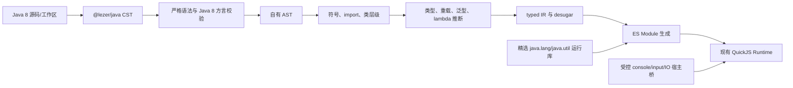

# Java 8 在 QuickJS/JavaScript 中运行的可行性调研

> 状态：调研完成；面向教学子集的阶段 0～3 与九个工程批次已落地，npm 包已提升至 `0.2.0`；
> 反射、文件、网络、动态加载和完整 Java SE 仍不在支持范围，也尚未作为完整 Java 8 产品发布。
>
> 调研与体量测量日期：2026-08-16（Asia/Shanghai）。

## 1. 结论先行

在当前“动态 npm 包 + 独立 QuickJS Runtime”体系中，支持一套面向教学和常用语法的 Java 8 运行能力是可行的，但它不是给 `@lezer/java` 增加一个 visitor 就能完成。`@lezer/java` 只解决语法识别；真正昂贵的是 Java 名字解析、类型系统、重载、泛型、类初始化、虚调用、异常和基础类库。

推荐路线是：

1. 继续复用当前 `@lezer/java`，把 Lezer CST 规范化为自有、带明确字段的 AST；
2. 在 AST 上实现受控的 Java 8 语义分析与少量 lowering；
3. 第一版将 typed IR 转译为 ES Module，由现有 QuickJS 执行，配一个小型 Java 运行时和精选类库；
4. 只有出现“逐语句调试、可暂停执行、确定性教学轨迹”这种明确需求时，才增加自有字节码解释器后端；
5. 明确采用 allowlist：常用语法和 API 支持，不常用 Java SE API 可以不实现，并在编译期给出稳定的“不支持”诊断。

不建议直接解释 Lezer CST，也不建议把 DoppioJVM、CheerpJ、TeaVM 或 J2CL 直接塞入当前动态 npm/QuickJS 链路。它们分别存在维护停滞、体量与 Node 依赖、浏览器/Wasm 与商业授权、必须在 JVM/Bazel 上提前编译等边界。

综合估算（均为累计量级，生产源码不含测试、生成代码和第三方源码）：

| 档位 | 目标 | 自研生产 LOC | 测试与语义用例 | npm 增量压缩 / 解压体量 | 人力量级 |
| --- | --- | ---: | ---: | ---: | ---: |
| Java 8 MVP | 教学最常用语法、OO、重载、泛型擦除、异常、lambda、数组、enum、基础集合与控制台 | 13k～22k | 7k～14k | 0.3～0.9 MiB / 1.2～3.2 MiB | 约 4～6 人月 |
| 常用增强版 | 更完整泛型/重载、常用 `java.lang/java.util`、日期时间和低成本正则兼容层 | 26k～44k | 15k～31k | 0.8～2.4 MiB / 4～10 MiB | 累计约 8～14 人月 |
| 受限真并行线程扩展 | 经典共享计数、自增竞态、`synchronized` 和独立计算加速 | 在所选档位上增加 4k～8k | 增加 3k～6k | 增加约 0.2～0.8 MiB；运行内存按线程增加 Runtime | 额外约 1.5～3 人月 |
| 完整兼容版 | 接近 Java SE 8：反射、线程/JMM、IO/网络、序列化、大型 JCL | 80k～160k+，或维护一个现有 JVM fork | 50k～150k+ | 20～50 MiB+ / 80～150 MiB+ | 累计 18～36+ 人月，之后持续维护 |

这里的“完整兼容版”仍不包括 JNI、AWT/Swing、真实本地文件系统等平台能力；如果这些也算在目标内，应直接选择成熟 JVM 产品或服务端沙箱，而不是继续自研。

## 2. 当前项目约束

本项目现有能力决定了方案必须满足以下条件：

- 动态语言能力以 npm 包加载，依赖图最终作为 ES Module 交给 QuickJS；
- 每个 Service 使用独立 Runtime，已有内存、栈、超时、中断和字节码缓存边界；
- npm 依赖解析、完整性校验、缓存和版本租约已经由 `code:npm` 提供；
- Java 编辑侧已经依赖 `@lezer/java@1.1.3`，并复用 Lezer 增量树；
- QuickJS 不是 Node.js，也不是浏览器：不能默认存在 `fs`、`net`、`worker_threads`、DOM、Web Worker 或浏览器 Wasm loader；
- App 目标不仅是 Web，因此依赖浏览器 CDN、HTML 或 Web API 的方案不能直接复用；
- Java 代码是用户输入，运行时必须继续受现有超时、内存和宿主能力 allowlist 约束。

这使“编译成普通 JavaScript，再由现有 QuickJS 执行”具有明显集成优势：不用再引入第二个 native VM，npm 下载、ESM 图、Runtime 生命周期和中断模型都可以沿用。

## 3. `@lezer/java` 能做什么、不能做什么

### 3.1 能承担 Java 8 语法解析

`@lezer/java@1.1.3` 的 grammar 已覆盖 Java 8 常用构造，包括类、接口、继承、泛型语法、annotation、enum、try/catch/finally、try-with-resources、lambda 和方法引用。其 grammar 还接受部分 Java 9 模块语法，因此“能解析”不能等价为“符合 Java 8”；编译入口仍要显式禁止 Java 8 之外的节点。

Lezer 的优势适合本项目：

- 纯 JavaScript、小包、可直接进入 npm/QuickJS 图；
- 语法树紧凑，并支持错误恢复；
- 能复用编辑器已有解析结果和节点命名知识；
- 增量解析适合高亮和即时诊断。

### 3.2 它不是编译器 AST

Lezer 官方文档明确说明其语法树“not abstract”：节点只保存类型、起止位置和子节点关系，没有节点在语义上的角色，也不会计算类型或符号。其设计目标是编辑器中的高亮、缩进和增量重解析，而不是执行 Java。

因此必须在 Lezer 之上补齐：

- 严格语法检查：运行前拒绝 error-recovery 产生的错误节点；
- CST -> AST：把位置型子节点转换为 `ClassDecl`、`MethodCall`、`CastExpr` 等稳定结构；
- package/import、词法作用域、名字分类和访问控制；
- 类层级、override/overload 区分、虚方法表和接口分派；
- 方法适用性、参数数量、varargs、基本类型提升、自动装箱、`null` 与继承层级的最具体重载；
- 泛型实参传播、自定义泛型类型推断、泛型继承代换、通配符/边界及泛型方法推断；
- 确定表达式类型、常量、条件表达式和 lambda 目标类型；
- 类初始化顺序、字段初始化、构造器链和异常展开；
- Java 到 JS/IR 的 lowering、诊断和源码位置映射；
- `java.lang`、`java.util` 等基础类库及宿主 IO 桥接。

换言之，CodeMirror/Lezer 可以承担前端的 parser，但不能承担 AST、类型检查器、编译器、JVM 或 Java 标准库。

### 3.3 直接解释 Lezer CST 的问题

直接从 CST 递归求值可在很短时间跑通表达式 demo，但不适合作为可扩展实现：

- 相同语法节点在声明、类型和表达式位置的含义不同，执行器会不断读取源码切片和猜测子节点角色；
- 错误恢复树可包含缺失/插入节点，若执行器未先严格校验，可能执行编辑中的无效程序；
- 类型检查和执行互相缠绕，重载、泛型和 lambda 目标类型会迫使多次遍历；
- `break`、`continue`、`return`、异常和 `finally` 容易退化成大量宿主异常与特殊返回值；
- 后续增加 JS 后端、解释器后端、诊断或调试器时难以共享。

直接 CST 解释只适合 1～2 周的 throwaway spike，不应成为正式架构。

## 4. 方案比较

| 方案 | 输入与执行 | 首个可用版本成本 | 优点 | 主要问题 | 结论 |
| --- | --- | ---: | --- | --- | --- |
| 直接解释 Lezer CST | Java 源码 -> CST -> tree-walk | 10k～18k LOC | 原型最快，不生成中间文件 | 语法/语义/执行耦合，重载和泛型会迅速失控；性能、诊断和测试差 | 仅作 spike |
| CST -> 自有 AST -> tree-walk | Java 源码 -> AST -> 解释 | 13k～22k LOC | 结构清晰，源码位置自然，便于做教学轨迹 | 热循环慢；控制流和异常仍在 AST 求值层；后续优化困难 | 可做 MVP，但不是首选执行后端 |
| CST -> typed AST/IR -> 自有字节码 VM | Java 源码 -> typed IR -> bytecode -> VM | 18k～32k LOC | 执行模型确定，适合暂停、单步、轨迹和配额 | 又造一套 VM；opcode、栈帧、GC/对象模型、调试器成本较高 | 有明确调试需求再做 |
| CST -> typed AST/IR -> JavaScript | Java 源码 -> ES Module -> QuickJS | 13k～22k LOC | 复用 QuickJS 执行、超时、中断、模块和字节码缓存；包体最小 | 需认真模拟整数、`long`、数组、分派、类初始化和 Java 异常；源码映射要自建 | **推荐** |
| TeaVM | `.class/.jar` -> JS/Wasm，AOT | 集成 2k～5k LOC，但需 JVM 构建服务 | 优化成熟、输出较小、支持 green threads | 官方要求先由 javac 等生成字节码；反射、资源、类加载器和 JNI 受限；不是动态 JS 内编译器 | 只适合服务端/构建期预编译 |
| J2CL | Java -> Closure JS，AOT | 集成 3k～8k LOC，但需 Bazel/JVM 工具链 | Java 语义和优化成熟，有 JRE emulation | 构建工作流重，不是可装入 QuickJS 的 npm 编译器；闭世界优化和 API emulation 有边界 | 不适合端上动态源码 |
| JSweet | Java -> TS -> JS，AOT | 集成 3k～8k LOC，但需 javac/Maven/tsc | 源码转译、JS 互操作成熟 | 工具链和运行类库在 JVM/Maven 侧，不能在当前 QuickJS 内直接执行 | 可作离线对照，不作端上方案 |
| DoppioJVM | `.class/.jar` -> JS JVM 解释 | 上游约 21.5k TS；移植再需约 8k～20k LOC | 真 JVM 指令和 OpenJDK 8 JCL，兼容面最接近目标 | npm 版本 2016 年发布；Node/BrowserFS/安装脚本依赖；仍缺端上 javac；完整体量巨大 | 不建议移植 |
| CheerpJ | `.class/.jar` -> 浏览器 Wasm JVM/JIT | 商业集成，不宜用 LOC 估算 | Java 8/11/17、反射、动态类加载和较完整 OpenJDK | 浏览器/Wasm/CDN 体系，不是 QuickJS；源代码仍需先编译；商业使用、自托管和再分发涉及授权 | 若产品改为 Web JVM 可单独商务评估 |

### 为什么不是“端上跑 TeaVM/J2CL”

TeaVM 官方定义是“把已有 JVM bytecode AOT 编译到 JavaScript”，依赖 javac/kotlinc/scalac；J2CL 的官方入门流程依赖 Bazel 和 Closure Compiler。将 javac、编译器本体及其类库再次编译到 JS，再塞进 QuickJS，理论上可行，但会把问题扩大为“在 JS 中运行 Java 编译器”，体量、冷启动和维护成本都远高于一个受控 Java 8 前端。

如果以后允许服务器编译，TeaVM/J2CL 会重新变得有吸引力：服务端接收源码、在隔离环境编译并签名产物，端上只下载 JS。但这会引入联网、排队、滥用防护、隐私和离线不可用问题，属于不同产品方案。

## 5. 推荐架构



### 5.1 前端

- 每个文件先由 `@lezer/java` 解析；编译执行不复用“带错误恢复也可工作”的宽松策略，发现错误节点即停止；
- CST 只在 adapter 层出现，其他模块只依赖自有 AST；
- AST 保存精确源码区间和源文件 ID，不保存 Lezer `SyntaxNode`，避免树更新后引用失效；
- 第一阶段只接受 Java 8 allowlist，显式拒绝 module、record、sealed class、switch expression、`var` 等后续语法。

### 5.2 语义层

- 按 package -> type -> member -> block 四层建表，支持多文件；
- 类型分为 primitive、array、declared、type variable、wildcard、null、void 和 error；
- override 在构建类层级/vtable 时决定，overload 在调用点按候选适用性和最具体规则决定，两者不能按“同名”合并；
- 泛型先实现 Java 8 编译期类型检查与推断，运行时统一擦除；只有数组、cast、`instanceof` 和桥接方法保留必要 reified 元数据；
- 对无法唯一解析或不在 allowlist 的调用编译失败，不做 JavaScript 动态兜底。

正式实现不需要同时长期维护一棵“完整 typed AST”和一棵内容高度重复的 IR。建议保留带源码区间的
规范化 AST，以语义 side table 记录符号与类型结果，再 lowering 为更小的 typed IR；JS 后端只读取
typed IR，不反向读取 CST、源码切片或语义表。这样既保留诊断所需信息，也避免两套大树同步演进。

### 5.3 lowering 与 JS 后端

- overload 用稳定的 descriptor/mangled slot 表示，虚调用通过类元数据/vtable 进入；
- lambda 转换为目标函数式接口实例；捕获变量按 Java effectively-final 规则校验；
- enhanced-for、try-with-resources、enum、boxing/unboxing 和字符串拼接降级成较小核心；
- Java `int` 运算在需要处使用 `|0`/`Math.imul` 等保持 32 位语义，`long` 优先验证 QuickJS `BigInt`，不满足时实现 `{hi, lo}`；
- Java 数组使用带 component type、固定 length、边界检查和默认值的 wrapper，不能直接把任意 JS Array 当 Java 数组；
- 类元数据处理 `<clinit>` 的按需、至多一次初始化以及失败状态；
- Java 异常对象与宿主错误分层，用户代码不能捕获超时、取消、OOM 等 Runtime 终止信号；
- 生成结果作为内部 ES Module 进入现有模块图和 QuickJS 字节码缓存，不暴露 `eval` 给用户代码。

### 5.4 精选类库

不要复制或转译 OpenJDK 的类库源码。第一版只实现小型、行为可测的 **Java API 兼容层**：

- Java 源码侧仅暴露教学常用类、构造器和公开方法签名，供类型检查、重载决议和补全使用；
- 运行侧由手写 JavaScript 实现，可直接映射到 JS 原生数据结构或紧凑 helper，不保留 OpenJDK
  的私有字段、内部类、继承结构、序列化格式及具体算法；
- 兼容目标是已支持公开 API 的可观察结果、异常类型和关键边界一致，而不是源码、字节码或内部
  执行过程一致；超出 allowlist 的类或方法在编译期报告“不支持”；
- 例如 `ArrayList` 可以封装 JS Array，`StringBuilder` 可以使用字符串片段，常见排序可以调用
  JS 排序后补 Java comparator 与稳定性规则；但 `HashMap/HashSet` 仍需实现 Java
  `equals/hashCode` 和冲突语义，不能直接假定 JS `Map/Set` 对自定义对象等价。

首批公开 API 建议为：

- `java.lang`：`Object`、`Class` 的极小只读视图、`String`、`StringBuilder`、包装类型、`Math`、`System`、`Throwable` 层级、`Comparable`、`Iterable`；
- `java.util`：`Iterator`、`Collection/List/Set/Map`、`ArrayList`、`LinkedList`、`HashSet`、`HashMap`、`Arrays`、`Collections`、`Objects`、`Optional` 的常用子集、`Scanner` 的教学子集；
- `java.util.function`：常见函数式接口；
- 输出与输入：`System.out/err`、受控的行输入；
- 增强阶段可按教学用例加入 `java.util.regex` 的兼容子集；`java.time` 当前不实现，后续只有在
  课程确实出现日期时间教学需求时再单独评估，避免为低频场景提前引入日期运算与格式化成本。

每个 API 必须明确三种状态：结果兼容、受限兼容、编译期不支持。不能让缺失方法在运行时退化为
`undefined is not a function`。新增类库能力优先扩展“签名描述 + JS 实现 + 行为测试”，不引入对应
OpenJDK 源码。allowlist 同时作用于“类”和“公开方法”：支持一个 Java 类不代表必须实现它的全部
public API，首版只承诺目录中明确登记的常用构造器、静态工厂和实例方法。

### 5.5 预留的受限真并行线程方案（本期不实现）

线程能力预期采用真正的宿主多线程，而不是单 Runtime 交错执行。该方案用于教学中的共享计数、
未同步自增丢失、`synchronized` 修复竞态，以及独立 CPU 任务并行后耗时下降；当前只记录方向，
待 Java 核心编译运行稳定后再做原型，不进入本期实现。

同一个 QuickJS Runtime 及其对象不能被多个宿主线程同时进入，因此设计方向为：

```text
Java 主线程 Runtime
       │ 创建 Thread，并传递共享对象句柄
       ▼
Kotlin 宿主线程池
       ├─ QuickJS Runtime A ─┐
       └─ QuickJS Runtime B ─┼─ 宿主共享 Java 堆
                            └─ 字段 / 静态字段 / 基础数组 / monitor
```

- 每个 Java `Thread` 绑定一个独立 QuickJS Runtime，并始终在对应宿主线程创建、执行和销毁，
  从而让相互独立的 CPU 任务真实占用多个核心；
- 用户对象跨线程时传递数字句柄；共享的基础类型字段、静态字段和基础数组存放在 Kotlin 宿主堆，
  JS Runtime 不直接跨线程共享对象；
- `count++` lowering 为宿主堆的读取、计算、写回三个步骤，未同步时允许真实丢失更新；
- `synchronized(obj)` 以对象句柄查找宿主 monitor，并通过 `try/finally` 保证异常路径释放；
- 首批仅支持 `Thread(Runnable)`、`start/join/sleep/currentThread/isAlive`，最多 4～8 个线程；
- 暂不支持跨线程共享普通集合、完整对象图、`volatile`、wait/notify、ThreadLocal、原子类、线程池、
  优先级和完整 Java Memory Model。

预计增量为 4k～8k 生产 LOC、3k～6k 测试 LOC 和额外约 1.5～3 人月。正式实现前先用 1～2 周原型
验证三个闸门：未加锁自增能够观察到丢失更新；加 `synchronized` 后结果稳定；两个独立 CPU 任务
在多核 Android、iOS 与 Desktop 上确实比串行执行更快。任一平台无法满足时，继续保持不支持，
不退回到会误称为并行的单 Runtime 交错模型。

## 6. Java 8 语法/API 逐项成本矩阵

### 6.1 估算口径

- LOC 是在“自有 AST + 语义 + JS 后端”推荐路线上的生产源码增量，不含测试、生成 parser、注释空行和第三方源码；测试通常还需生产 LOC 的 0.5～0.9 倍；
- 体量是发布 npm 后的**边际**压缩/解压量级，记为“gzip / unpacked”；共享框架、重复 helper 和压缩字典会使各行不可简单相加；
- 难度同时考虑语法、Java 语义、QuickJS 平台差异和测试矩阵；
- “延后”不等于静默忽略，必须在编译期稳定报错；
- 常用度以入门/数据结构/常规业务教学为准，不以完整 Java SE 服务端应用为准。

| 能力 | 教学常用度 | 难度 | 预计新增 LOC | npm 边际压缩 / 解压 | 关键依赖与边界 | 建议 |
| --- | --- | --- | ---: | ---: | --- | --- |
| package、import、多文件、声明与作用域 | 高 | 中 | 1.2k～2.5k | 30～90 / 120～320 KiB | AST、工作区类型表、循环依赖和可见性 | MVP 必须 |
| 字面量、表达式、赋值、控制流、方法与局部变量 | 极高 | 中 | 2k～4k | 60～160 / 220～550 KiB | 数值语义、短路、labeled break/continue、return | MVP 必须 |
| primitive、数值转换、boxing/unboxing、`String` | 极高 | 中高 | 1.2k～2.8k | 40～130 / 150～450 KiB | Java promotion、溢出、`char`、`long`、NPE | MVP 必须；`long` 先做兼容性 spike |
| 数组、可变参数、enhanced-for | 极高 | 中 | 0.9k～1.8k | 25～70 / 90～230 KiB | 固定长度、默认值、协变、边界检查、`ArrayStoreException` | MVP 必须 |
| 类、接口、构造器、继承、多态、内部/匿名类 | 极高 | 高 | 3k～6k | 90～260 / 350～900 KiB | 类初始化、super、vtable/itable、访问控制、synthetic outer ref | MVP 做常用子集；局部/匿名类可后半段加入 |
| override 与 overload 区分 | 极高 | 高 | 0.8k～1.8k | 25～80 / 100～280 KiB | 类层级、签名擦除、桥接方法、返回类型协变 | MVP 必须 |
| 方法重载决议（参数数量、varargs、数值/装箱） | 极高 | 高 | 1.5k～3.2k | 45～140 / 180～500 KiB | 候选集、三阶段适用性、最具体方法、常量窄化 | MVP 必须，按 Java 正常选择 |
| `null` 与继承层级的最具体重载 | 高 | 高 | 0.4k～0.9k | 10～40 / 40～130 KiB | null type、子类型关系、歧义诊断 | MVP 必须 |
| 泛型擦除、实参传播、自定义泛型类型 | 高 | 高 | 1.4k～3k | 45～140 / 180～500 KiB | type variable、substitution、raw type、bridge method | MVP 支持常见类泛型；raw type 可受限 |
| 泛型继承代换、通配符/边界、泛型方法推断 | 中高 | 很高 | 2k～5k | 70～220 / 280～850 KiB | capture conversion、约束归约、target typing、重载互相依赖 | MVP 覆盖常见用法；复杂交叉边界放增强版 |
| 异常、`finally`、multi-catch、try-with-resources | 高 | 高 | 1.2k～2.8k | 40～130 / 160～480 KiB | abrupt completion、suppressed exception、宿主终止信号隔离 | MVP 必须；完整 suppressed 语义可增强 |
| lambda、方法引用、函数式接口 | 高 | 很高 | 1.5k～3.5k | 50～170 / 200～600 KiB | 目标类型、overload、泛型推断、捕获、默认方法 | MVP 支持常见 lambda；复杂交叉类型增强 |
| `enum` | 高 | 中 | 0.5k～1.2k | 15～55 / 60～180 KiB | 类/静态初始化、`values/valueOf`、switch lowering | MVP 必须 |
| annotation 语法与保留策略 | 中 | 中/高 | 0.4k～1.2k | 10～60 / 50～220 KiB | 仅语法忽略较便宜；运行时 annotation 依赖反射元数据 | MVP 解析并校验常用项；运行时读取延后 |
| 常用 `java.lang/java.util` 公开 API 的 JS 兼容层 | 极高 | 中高 | 2.5k～6k | 80～320 / 0.3～1.3 MiB | 只实现 allowlist 签名；内部使用 JS；仍需保证泛型、迭代器、hash/equals、排序和异常的可观察结果 | MVP 做精选集；增强版按教学用例扩充，不移植 OpenJDK 源码 |
| `java.time` | 低 | 中高 | — | — | 即使只支持常用类型，也需要处理闰年、日期运算、解析和格式化语义 | 当前不实现；遇到明确课程需求后单独评估 |
| 正则常用 API 的 JS 适配 | 低/中 | 中 | 0.3k～1k | 10～60 / 40～220 KiB | `Pattern/Matcher`、`String.matches/split/replaceAll` 映射到 JS RegExp；只承诺常用语法交集，Java 特有语法明确拒绝 | 增强版按教学用例加入，不自研正则引擎 |
| 反射、动态类加载、运行时 annotation | 低/框架高 | 很高 | — | — | 依赖完整类/成员元数据、访问检查和保留不可达代码 | 不纳入当前实现范围 |
| 受限真并行 `Thread` 与 `synchronized` | 中 | 很高 | 4k～8k | 0.2～0.8 MiB；每线程额外持有 Runtime 内存 | 每线程独立 Runtime；基础字段、静态字段和基础数组下沉宿主共享堆；对象句柄 monitor | 后续独立扩展，本期不实现；先通过三平台原型闸门 |
| 控制台输入输出桥 | 极高 | 中 | 0.3k～0.8k | 10～45 / 40～160 KiB | `System.out/err` 映射 JS 输出回调，`System.in` 与 `Scanner` 常用读取映射受控 JS 输入队列 | MVP 必须；不因此开放文件、流或宿主对象 |
| IO/文件 | 中 | 很高 | — | — | QuickJS 无通用 `fs`，开放后还涉及 VFS、权限和路径安全 | 不提供；`java.io.File`、文件流和真实文件系统均在编译期拒绝 |
| 网络 | 低/工程高 | 极高 | — | — | Socket 阻塞模型、权限和 SSRF 风险不符合教学沙箱边界 | 不提供 |
| Java 原生序列化 | 低 | 很高 | — | — | `ObjectStream` 依赖反射、对象图协议并存在安全风险 | 不提供 |

### 6.2 依赖关系中的关键路径

最容易低估的是功能之间并非独立：

```text
类层级 -> override/vtable -> 虚调用
类型系统 -> overload -> 泛型方法推断 -> lambda/方法引用目标类型
对象模型 -> 数组/异常/集合/enum
类初始化 -> enum/静态字段/常用类库
独立 QuickJS Runtime -> 宿主共享字段/数组 -> synchronized monitor -> join 与生命周期
JS 宿主桥 -> System.in/out/err 与 Scanner 输入队列
```

因此不能通过“先按参数数量选重载、以后再补类型”得到可靠中间版本。可以分阶段覆盖规则，但每个已宣称支持的调用都必须走一致的适用性与最具体规则；不支持的边界应明确报错。

## 7. 三档范围

### 7.1 Java 8 MVP：日常教学可用

建议包含：

- 多文件 package/import、顶层和常见嵌套类型；
- 表达式、控制流、方法、字段、构造器、类/接口/继承/多态；
- override/overload 分离，以及参数数量、基本类型、装箱、varargs、`null`/继承层级的重载；
- 常见类泛型、泛型方法、边界和继承代换；复杂 wildcard capture 可以明确拒绝；
- 数组、enum、annotation 语法、异常、lambda、方法引用；
- `System.out/err`、行输入、`String`、包装类型、`Math`、集合常用实现和函数式接口；
- 单入口 `main(String[])`，同时允许测试 harness 调用指定静态方法；
- 所有不支持 API 在编译期报错。

本期明确不包含：`Thread/synchronized`、反射、动态类加载、运行时 annotation、完整 JMM、
wait/notify、`java.util.concurrent`、文件 IO、网络、JNI、AWT/Swing、原生序列化、完整
locale/timezone。`Thread/synchronized` 仅按 5.5 节作为后续独立扩展预留，其余能力不进入当前路线。

### 7.2 常用增强版：一般算法和轻业务代码

在 MVP 上增加：

- 更完整的 Java 8 泛型约束、capture conversion、复杂 target typing 和桥接方法；
- 内部类、局部类、匿名类、default method 冲突等边角；
- 扩充 `java.lang/java.util` 的公开 API JS 兼容层，加入 Stream 常用顺序操作和 `Optional`；
- 基于 JS RegExp 的 `Pattern/Matcher` 常用交集；选中某个类不等于实现其全部 public API；
- 更好的源码映射、栈帧和编译诊断。

仍不包含 `java.time`、线程和完整 JMM、文件 IO、任意网络、反射、动态类加载、运行时
annotation 和 Java 原生序列化；这些能力不作为当前增强版范围。

### 7.3 完整兼容版：接近 Java SE 8

如果目标升级为“运行未经修改的常见 jar/框架”，本质上已经是 JVM 项目：

- 输入应改为标准 `.class/.jar`，而不是继续扩张 Java 源码转译器；
- 需要 classfile verifier、JVM 指令、类加载器、反射、线程/monitor、native method 层和 OpenJDK JCL；
- QuickJS 的单线程和宿主 API 不再是自然承载平台；
- 应重新评估 CheerpJ 商业授权、服务端 JVM 沙箱，或维护一个现代 JVM-in-Wasm/JS 方案。

DoppioJVM 的实测数据说明这一档的体量下限：JVM npm 包本身约 4.04 MiB gzip/30.7 MiB 解压，安装时再下载约 37.7 MiB gzip/97.0 MiB tar 的 Java Home，尚未计算 npm 传递依赖。它与当前轻量动态语言包不是同一量级。

## 8. npm 包体量测量

### 8.1 方法

2026-08-16 使用以下方式测量：

1. `npm view <name>@<version> dist.unpackedSize dist.tarball dependencies --json` 读取 npm Registry 元数据；
2. 从 `dist.tarball` 下载 `.tgz` 到临时目录，以实际文件字节数作为 gzip 体量；
3. 解包或读取 tar/gzip 大小，核对解压体量；
4. 传递依赖按锁定版本去重后求和；这个数字是包存储量，不等于经过 Kotlin/JS/JS bundler tree-shaking 后的最终产物；
5. DoppioJVM 的 Java Home 使用其 `install.js` 指向的官方 `doppio_jcl v3.2` release 实测。

### 8.2 结果

| 包/依赖图 | 版本 | gzip/tgz | Registry unpacked 或实测解压 | 备注 |
| --- | --- | ---: | ---: | --- |
| `@lezer/java` 单包 | 1.1.3 | 60.1 KiB | 175.4 KiB | 当前项目已经直接依赖 |
| Lezer Java 完整去重图 | java 1.1.3 + common 1.5.2 + lr 1.4.10 + highlight 1.2.3 | 174.2 KiB | 676.5 KiB | 在本项目中 common/lr/highlight 已共享，实际增量更接近上一行 |
| `java-parser` 单包 | 3.0.1 | 45.4 KiB | 251.0 KiB | 官方说明输出 CST，不输出 AST |
| `java-parser` 完整去重图 | 含 Chevrotain 11.0.3、lodash/lodash-es 等 | 893.5 KiB | 约 3.9 MiB | 解析树更具 visitor 结构，但替换 parser 仍不提供 Java 语义/执行能力 |
| `doppiojvm` npm tarball | 0.5.0 | 4.04 MiB | 约 30.7 MiB | 包内 TS 生产源码实测约 21.5k 行；2016-10-30 发布 |
| Doppio Java Home | `doppio_jcl` v3.2 | 37.7 MiB | tar 约 97.0 MiB | npm 安装脚本额外下载；release 发布于 2015-11-13 |
| Doppio 最低合计 | 上两行，不含 npm 传递依赖 | 约 41.7 MiB | 约 127.7 MiB | 仍只解决 `.class/.jar` 运行，不解决 Java 源码编译 |

`@lezer/java` 自带 grammar 约 748 行，但这 748 行只是语法规则。把它与 13k～22k LOC 的 MVP
对比，能直观看出成本主要在语义、lowering、运行时与类库，而不在 parser。

## 9. 分阶段计划与停止条件

所有实现阶段均采用同一条正式链路：

```text
Lezer CST -> 规范化 AST + 语义 side table -> typed IR -> ES Module -> QuickJS
```

不能在前几个阶段使用一套临时 CST 解释器、后续再整体改写为 JS 后端。阶段可以只覆盖少量语法，
但已覆盖语法必须端到端走完正式链路。每新增一种能力，都同时补齐 AST 转换、语义规则、typed IR、
JS 生成、QuickJS 行为测试和 javac 差分测试，避免前端与后端各自演进后再集中集成。

### 阶段 0：纵向架构 spike，不承诺产品能力

目标：用最小但可保留的正式骨架验证最危险的后端假设，而不是制作 CST tree-walk 原型。

- 定义最小规范化 AST、语义 side table、typed IR 与 Java 源码位置模型；
- 仅支持 `int/boolean/String/null`、局部变量、静态方法、静态重载、分支/循环和多文件同包调用，
  端到端生成 ES Module；对象创建与虚调用留到建立类层级后，不能以动态 JS 调用临时模拟；
- 先以 Node 单元测试执行生成的 JavaScript，确认 Java 语义 helper 和输出结构；随后再接入现有
  QuickJS 模块、超时中断和输出链路；
- 验证 `int` 溢出、`long/BigInt`、递归栈、用户异常与宿主终止信号隔离；
- 记录 50～100 个小程序的编译/运行时间、生成 JS 大小和内存峰值。

阶段产物只有在层次边界稳定时才保留；允许重写具体节点设计，但不改变正式数据流。

停止条件：

- QuickJS 对 `BigInt`、模块生成或中断不满足要求，且替代实现会使 MVP 增加超过约 5k LOC；
- 典型 200～500 行教学程序的冷编译明显超过交互阈值，或内存峰值经优化仍突破单 Runtime 预算；
- JS 后端必须重新读取 CST 或源码才能生成正确代码，说明 AST/IR 边界设计失败；
- 生成 JS 无法稳定隔离用户异常与宿主终止信号。

#### 阶段 0 实现结果（2026-08-16）

- 已建立 `JavaSourceWorkspace -> AST -> JavaSemanticModel -> JavaIrProgram -> ES Module` 的固定边界，
  每层只读取上一层稳定契约；
- CST adapter 会拒绝 Lezer 错误恢复树，并映射 package/import、class、static 方法、局部变量、
  `if/else`、`while`、classic `for`、return、基础表达式和静态调用；未开放的数组、泛型、
  vararg、继承、嵌套类型与控制流会整体报错，不会被 CST 遍历静默擦除；
- 语义分析采用“全部类型 -> 全部方法签名 -> 方法体”三遍流程，支持前向/跨文件静态调用、
  package/import 可见性、词法作用域、definite assignment、`final`、同名重载、`null` 引用
  重载歧义，以及 public 顶层类型与 Java 文件名一致性检查；
- typed IR 已消除名称猜测，JS 后端已实现 32 位 `int` 的溢出、乘除余数、局部读写、控制流、
  静态调用和单一稳定入口导出；
- 已用真实多文件 Java 源码贯穿完整流水线，并在 Node 中执行生成代码；该静态子集继续作为
  Stage1 的回归基线。端上执行复用既有独立 QuickJS Runtime 和 ES Module 加载链路。

### 阶段 1：编译器核心纵向闭环

- 固化 MVP 范围内的 AST schema 和 Java 8 dialect 校验；
- 建立多文件 package/import/type/member/block 符号表；
- 完成 primitive、转换规则、类层级、override、基础 overload 与常见泛型约束；
- typed IR 中的调用、字段和类型操作必须已解析，不允许 JS 后端按名称动态猜测；
- 以“小批语法 -> typed IR -> JS 快照 -> QuickJS 输出 -> javac 对照”的顺序持续交付；
- 阶段末应能运行只依赖极小内建 runtime 的控制流、方法和简单类教学程序。

#### 当前阶段 1 实现进度（2026-08-16）

- AST 和 Java 8 方言层已支持 class 泛型、单继承、字段、构造器、实例/static 方法、`this`、
  `super`、`new`、通配符、显式方法类型实参与 diamond；未开放语法会在前端整体拒绝；
- 语义层采用类型、继承、成员和方法体多遍分析，已支持构造委托与循环检查、字段访问、
  override/虚槽和 static hiding，以及 exact、primitive/reference widening、`null` 最具体重载；
- 常用 class/method 泛型已支持边界校验、不变类型参数、继承代换、`? extends/? super`、
  实参驱动的方法与 diamond 推断；raw、capture member 操作和 target-only inference 保持关闭；
- typed IR 与 JS 后端已接入对象分配、父类优先初始化、字段默认值、lazy class initialization、
  constructor special call 和 virtual dispatch，并校验 receiver、构造委托与虚槽完整性；
- 完整 `jsNodeTest` 共 147 项通过，其中真实源码端到端用例会执行生成的 JavaScript，覆盖
  多文件 static 回归、构造器/继承/override 和泛型继承代换；
- 当前运行子集仍以 `int/boolean/String/null` 为主。`long`、浮点完整运行语义、boxing、数组、
  接口分派、异常与 lambda 继续留在后续阶段，遇到时返回稳定的不支持诊断。

停止条件：

- 为常见重载/泛型程序对齐 javac 需要大量逐例补丁，而不能归纳为规则；
- AST schema 因 Lezer 节点歧义持续返工，说明应更换 parser 或引入更强 Java frontend；
- typed IR 持续泄漏 Lezer 节点名或 JavaScript 表达形式，说明分层方向错误。

### 阶段 2A：补齐 Java 语言 MVP

阶段 2A 与阶段 2B 是两条可以交错交付的能力线，而不是必须全部串行完成的版本号。当前阶段 2B 的
精选类库与宿主桥已经形成纵向闭环，但不代表阶段 2A 的 Java 语言能力已经完成。后续工作继续归入
阶段 2A，不新增“阶段 2C”；只有下列剩余语言能力通过阶段闸门后，才进入阶段 3 产品化。

- 在已有 class 构造器链、初始化和虚分派基础上补齐接口初始化、接口分派与 default method；
- 完成数组、boxing/unboxing、字符串拼接、异常/`finally`、enum；
- 完成常见泛型擦除与桥接、lambda、方法引用和函数式接口；
- 对复杂 wildcard capture、低频语法和不支持 API 给出稳定的编译期诊断，不动态降级；
- 每项能力继续通过 typed IR 单测、JS 快照、QuickJS 行为和 javac 差分四层验证。

剩余工作固定为九个可独立提交的批次；每批都必须同步更新本文档、通过完整 `jsNodeTest` 后再进入下一批：

1. （已完成，2026-08-18）异常基础：`throw`、`try/catch/finally`、有序多 catch、常用运行时异常，
   并让数组、集合和 Scanner 已产生的 Java 命名异常可被源码 catch；
2. （已完成，2026-08-18）异常完整语义：checked exception 与 `throws`、multi-catch、自定义异常、
   常用 Throwable API，以及受控资源上的 try-with-resources/AutoCloseable；
3. （已完成，2026-08-18）函数式接口与 lambda：无捕获/有捕获 lambda、effectively-final 校验和
   目标类型推断；
4. （已完成，2026-08-18）方法引用：静态、绑定 receiver、未绑定 receiver 与构造器引用，复用
   函数式接口适配链；
5. （已完成，2026-08-18）多维数组：部分维度创建、嵌套初始化器、协变写入与逐维越界/
   求值顺序；
6. （已完成，2026-08-18）`enum`：枚举常量、字段/构造器/方法、`values/valueOf`、
   `name/ordinal`、switch、接口实现与受控初始化；
7. （已完成，2026-08-18）完整数值：`long`、`float`、`double`、数值提升、显式/隐式转换、
   位运算、比较及常用 Math/包装 API；
8. （已完成，2026-08-18）泛型与语言收口：目标类型方法推断、常用 wildcard capture、桥接分派、
   数组形式的可变参数声明与 Java 第三阶段调用决议，低频项保持稳定诊断；
9. （已完成，2026-08-18）产品化：源码栈映射、缓存与增量编译、npm/端上链路、资源限制、
   fuzz 和跨平台发布验证。

接口分派、Object 虚方法和常用控制流已经作为上述九批的前置基础完成。低频 wildcard capture、
反射、文件、网络和动态类加载仍保持关闭。

阶段闸门：不依赖大规模类库的 Java 8 语言样例能够稳定编译执行，生成 JS 中不存在未解析的
Java 名称，也不会把 JavaScript 的动态类型行为泄漏为 Java 语义。

#### 当前阶段 2A 首批实现进度（2026-08-18）

- 已贯通 primitive/引用数组的前置类型声明、`new T[n]`、花括号初始化器、元素读写、
  `length`、复合赋值和 `++/--`；数组 receiver、index 与右值保持 Java 从左到右且只求值一次；
- JS runtime 已补齐默认元素值、负长度、空数组引用、越界和引用数组协变写入检查；引用组件在
  typed IR 中明确区分 Object、String 与用户类，非法协变写入会抛出 `ArrayStoreException`；
- byte、short、char 与 int 数组在写回边界执行 Java 窄化，避免把 JavaScript Number 的结果直接
  泄漏为 Java 数组元素；boolean 数组同样在统一写回入口收敛为布尔值；
- String `+` 与 `+=` 已支持 String、null、boolean、byte、short、char 和 int，并显式保存每个
  操作数的转换类别；任意对象、数组、long 与浮点字符串化继续返回稳定的不支持诊断；
- 已支持用户 interface、interface 继承、class `implements`、泛型接口代换和 interface 虚分派；
  class 方法优先于 default method，互不相关的 default 冲突会在编译期报告；
- 接口 abstract、default 和 static 方法均沿正式 AST、语义 side table、typed IR 与 JS vtable 链路
  执行；针对 @lezer/java 1.1.3 的 default modifier grammar 缺陷，前端使用等长解析文本归一化，
  不改变源码 span、字面量或最终 AST；
- 已把 `Object.toString/equals/hashCode` 建模为稳定虚方法根；用户类 override 会复用相同虚槽，
  `PrintStream`、`StringBuilder.append(Object)` 与集合查询均通过动态分派观察用户对象语义；
- 已支持 `do-while`、无标签 `break/continue`，经典 `for` 在 typed IR 中保留 update 区域，确保
  `continue` 仍先执行 update；循环 break 出口也会参与 definite-assignment 交集；
- 已支持数组、`List`、`Set` 的增强 `for`，迭代变量的装箱/拆箱与赋值转换由 semantic side table
  固定；`switch` 已支持 int-like（含对应 wrapper）与 String 教学用法、连续 case、fallthrough、
  default、switch break 及 String null 检查；重复 case/default 和不可迭代对象会在编译期报告稳定诊断；
- 已支持 `throw`、`try/catch/finally` 和多个有序 catch；常用 RuntimeException 层级进入 builtin catalog，
  显式抛出以及数组、集合、Scanner 已有运行时错误都按 Java 继承关系匹配首个 catch；
- JS 后端使用原生结构化 try/finally，因而 `finally` 会正确覆盖 return/throw，并在 break/continue
  前执行；宿主超时、取消和内存终止信号仍不包装为可被 Java 源码捕获的普通异常；
- checked exception 已在 throw、调用、构造器委托和 override 边界校验 `throws` 传播；multi-catch 会检查
  备选类型关系与可达性，自定义 checked exception 会保留继承、message、cause 和动态 `toString`；
- `Throwable.getMessage/getCause/toString` 与 `AutoCloseable.close` 通过 builtin 虚槽进入用户 override；
  try-with-resources 会按 Java 顺序初始化、逆序关闭，并在关闭失败时保留主异常和 suppressed 链；
- `Scanner` 已实现幂等 `close`，关闭后继续读取会抛 `IllegalStateException`；文件、网络等资源仍不开放，
  资源语法只接受用户 `AutoCloseable` 和 allowlist 内的受控资源；
- 已支持用户 SAM、`Runnable` 以及 `Consumer/Function/Supplier/Predicate` 目标类型的表达式体和 block
  lambda；参数类型由目标接口代换，捕获值保持词法闭包，外围任意写入都会触发 effectively-final 诊断；
- Lambda 已贯穿 CST、AST、semantic binding、typed IR 和 JS vtable；无捕获/有捕获、显式/推断参数、
  泛型函数式接口与 overload 目标类型均有回归，非 SAM 目标会在编译期稳定拒绝；
- 已支持 `Type::staticMethod`、`value::instanceMethod`、`Type::instanceMethod` 与 `Type::new`；所有
  引用先按目标 SAM 参数执行 overload 和转换，再复用 Lambda 函数对象 ABI 与既有虚槽分派；
- 绑定 receiver 会在函数对象创建时求值并固定一次，null 会立即抛出 `NullPointerException`；
  `System.out::println`、`String::length`、`StringBuilder::new` 等 builtin 同样只通过 catalog binding；
- 已支持 `new T[a][b]`、`new T[a][]` 和递归花括号初始化器；所有维度长度先按源码顺序
  各求值一次，再只分配具有长度的连续前缀，未分配的内层保持 null；
- 多维数组的运行时 component descriptor 会逐层保存 primitive/String/Object/用户类信息；数组
  协变视图下的嵌套写入仍执行递归 `ArrayStoreException` 检查，不退化为 JavaScript Array 判断；
- 完整 `jsNodeTest` 共 240 项通过，真实源码到 JS 执行用例覆盖多维数组求值顺序、部分分配、
  嵌套初始化、协变写入、泛型接口/default 分派、异常流、lambda 与四种方法引用；
- enum 常量在普通静态字段初始化顺序中完成唯一实例构造，`name/ordinal` 在构造器执行前即可观察；
  `values()` 每次返回新的受类型检查数组，`valueOf()` 保持 null/未知名称异常，enum switch 使用稳定 ordinal；
- enum 可声明实例字段、private/package-private 构造器、普通方法并实现接口；直接 `new`、public/protected
  构造器、显式 abstract/final 和常量专属匿名 class body 会给出稳定诊断；
- 完整 `jsNodeTest` 共 244 项通过，新增真实源码执行用例同时覆盖 enum 初始化、接口分派、比较、
  防御性 values 数组、valueOf 异常与 switch；
- 已完成 `long`、`float`、`double` 字面量与运行表示、Java 数值提升、窄化/拓宽、显式数值 cast、
  复合赋值及 `++/--` 回写；`long` 通过 BigInt helper 保持 64 位溢出、除余、移位与无符号右移语义，
  `float` 在运算和写回边界使用 `Math.fround` 收敛为单精度；
- 位移、按位运算、NaN/Infinity、浮点比较、数组默认值和字符串拼接均沿 typed IR 显式建模，
  不直接借用 JavaScript 的动态转换；数值 cast 与外层赋值转换可顺序组合，不会互相覆盖；
- `Long/Float/Double` 已加入装箱、拆箱、缓存身份、equals/hashCode/toString 与 Number 转换链；
  `PrintStream`、`StringBuilder` 和 Math 的常用 long/float/double overload 也通过 builtin operation 接入；
- 完整 `jsNodeTest` 共 249 项通过；新增真实源码执行覆盖 long 溢出与移位、浮点特殊值、Math、
  primitive/wrapper 强转和 StringBuilder 输出，Java 模块 35 个源码/测试文件经 IDE 全量诊断为 0 error；
- 已支持泛型方法从赋值、return 与调用目标类型反向推断，实参约束和目标约束共用统一推断器；
  `List<? extends T>` 读取、`List<? super T>` 写入以及无界 wildcard 的 Object 读取/null 写入均已覆盖；
- 已支持方法和构造器的 `T...` 声明，重载严格遵循 fixed strict -> fixed loose -> variable-arity
  三阶段；只有第三阶段会在 lowering 中创建并打包新数组，直接传入现成数组仍保持 fixed arity；
- 泛型 override 会先按子类视角代换父参数，再复用擦除后的稳定 JS 虚槽；这在运行结果上等价于 JVM
  bridge method，因此 JS 产物无需额外生成只负责转发的物理桥方法；
- 完整 `jsNodeTest` 共 254 项通过；新增真实源码执行覆盖目标类型推断、零/多尾参数 vararg、固定数组
  调用、可变参数构造器与常用 wildcard 集合读写；
- raw type、复杂 capture/F-bound/交叉约束推断、后置数组声明、泛型数组创建、常量专属 enum class body、
  十六进制浮点字面量和 `-9223372036854775808L` 的特殊词法边界暂不扩展，均保持编译期诊断。

### 阶段 2B：精选类库与宿主桥

- 先建立类与公开方法级别的 allowlist 描述，供类型检查、补全和运行实现共同读取；
- 按 `java.lang` 基础类型 -> 集合接口与实现 -> `Scanner` 教学子集的顺序加入；函数式接口依赖
  lambda、方法引用和接口分派，推迟到对应语言能力完成后统一接入；
- 每个公开 API 同时声明“结果兼容、受限兼容、编译期不支持”之一，并补可观察行为测试；
- 接入 `System.out/err`、受控行输入和 Runtime 配额，不开放文件、网络或任意宿主对象；
- `java.time` 不进入本阶段，正则仅在真实课程用例需要时加入常用交集。

阶段闸门：课程与数据结构样例只使用 allowlist API 即可运行；缺失 API 一律在编译期以 Java
源码位置报告，不能落到 `undefined is not a function` 等 JavaScript 错误。

#### 当前阶段 2B 实现进度（2026-08-17）

- 已建立唯一 builtin allowlist，类型、字段、构造器和方法通过稳定 operation 贯穿语义模型、
  typed IR、validator 与 JS runtime；未登记 API 在编译期报告，不通过成员名称猜测运行逻辑；
- 已支持 `System.out/err`、`PrintStream.print/println`、常用 `String` 与 int `Math` 方法，输出按
  stdout/stderr 分流；宿主桥使用受限 UTF-8 Base64 分块，并限制输入、输出字节数；
- 已支持 boolean、byte、short、char、int 的装箱/拆箱，Boolean、Byte、Short、Character、Integer、
  Number 常用方法与 Java 8 缓存身份，并按 strict、loose 两阶段执行重载决议；
- 已支持 `StringBuilder` 常用构造、append、查询、修改、reverse、substring 和 toString；运行时保持
  可变对象与别名语义，越界与 null 通过 Java 命名异常报告；
- 已支持 List/ArrayList、Set/HashSet、Map/HashMap、Iterator 教学子集、目标类型 diamond、
  `remove(int)`/`remove(Object)` 重载、backed `keySet` 以及集合别名修改；
- 集合键对 null、String、包装类型和用户对象采用 Java `equals/hashCode` 查询语义；用户类覆盖
  两个 Object 根方法后会参与 contains/get 等查询。fail-fast iterator 尚未实现，因此集合 API
  仍标记为受限兼容；
- 已支持预加载输入下的 `new Scanner(System.in)`，包含 hasNext、next、hasNextInt、nextInt、
  hasNextLine、nextLine；多个 Scanner 共享输入游标，非法 nextInt 不消费 token；整数仅接受常用
  ASCII 十进制形式，不支持运行中等待输入；
- `PrintStream` 与 `StringBuilder` 已覆盖 String、char[]、包装值、受控 builtin 和用户对象；用户类
  覆写 `toString` 时走 Object 虚槽，未覆写时生成稳定的 Java 风格 `ClassName@identityHash` 文本；
- Java 与通用语言模块的完整测试已覆盖真实源码到 JS、真实 JS runtime、Unicode I/O、配额、
  泛型集合、包装缓存和 Scanner 混合读取。接口分派、常用函数式接口、lambda 与捕获变量语义已经
  接通；方法引用也已复用相同 SAM 适配链，不额外维护第二套函数对象 runtime。

### 阶段 3：产品化与发布验证

- （已完成，2026-08-18）完成 Java 源码诊断与稀疏生成位置映射；通用 Runner 会把真实
  QuickJS 文件名、行列和 stack 还原为 Java UTF-16 源位置，编辑器输出面板不再只展示生成 JS 栈；
- （已完成，2026-08-18）编辑器 Run 面板将编译输出与结构化诊断分层展示，诊断按严重程度着色，
  显示稳定 code、文件、1-based 行列和关联说明；点击主位置可切换文件并选中 UTF-16 区间，运行中
  的 gutter 重复点击不会再并发创建第二次编译执行；
- Java Service 为完全相同的编译请求维护最多 8 项、估算文本总量最多 8 MiB 的 LRU 结果缓存；
  超大单项不缓存。源码变化时复用独立的 Lezer 增量 CST，但为保证正确性仍完整重建语义、typed IR 和 JS。编译结果会报告 `FULL`、
  `INCREMENTAL`、`EXACT`、工作区规模与耗时，运行面板可直接观察缓存是否命中；
- 编译入口限制为最多 128 个文件和 1,000,000 个 UTF-16 code unit；通用 Runner 在创建隔离
  Runtime 前限制 256 个 Module 与合计 4 MiB 生成源码，并继续执行 32 MiB 内存、256 KiB 栈、
  5 秒运行、64 KiB 输入输出等既有边界；
- 增加固定种子的 200 例畸形源码 corpus，覆盖删除、插入、替换、恢复树和孤立代理字符；任何
  输入都必须得到 AST 或结构化诊断，不能把 parser/adapter 内部异常泄漏给业务；
- （已完成，2026-08-18）建立可扩展的 javac/java 差分测试体系：语料独立放在
  `src/javacDifferentialTest/cases`，`generateJavacDifferentialFixtures` 在 jsTest 编译前使用 Gradle
  当前 JDK 的 `javac --release 8` 生成不可变 Kotlin 基准；Node 侧对同一源码比较编译结论、归一化
  诊断类别、stdout、stderr 和未捕获异常类型。语料已从首批 16 项扩展到 40 项，并设置不可静默
  缩减与 ID 唯一性闸门；新增覆盖 strict/loose 重载、泛型方法与上下界、集合视图、装箱缓存、
  UTF-16 String、数值/数组边界、类初始化、构造期虚分派、接口默认方法、lambda 捕获、方法引用、
  嵌套异常和 Scanner 行终止符。语料同时发现并修复类型变量 receiver 未按首上界查找成员的问题；
- （已完成，2026-08-18）建立 Android、iOS 与 Desktop 共用的五阶段性能基准，统一测量语言包
  加载、FULL、INCREMENTAL、EXACT 编译及隔离 Runtime 执行，并允许各平台注入内存采样器；
  Desktop 已使用本地 debug npm 图完成真实 QuickJS 基线，获取命令、报告位置、Android PSS 与
  iOS Instruments 口径记录在 `java-performance-benchmark.md`；
- 教学程序仍为每次运行创建并关闭独立 Runtime，明确关闭 QuickJS 跨次字节码缓存；可复用的是
  已校验的编译结果和增量 CST，避免把运行状态或旧版本 bytecode 带入下一次执行；
- `@cyxbs-mobile/language-java@0.2.0` 已按依赖拓扑生成独立 tgz，压缩 268.3 kB、解压约
  1.9 MB，仅包含 ESM、类型声明和 package.json，不携带 source map；调试图也已生成到项目根
  `build/npm/debug-source`，版本提升会使桌面与端上缓存自然失效；
- 完整 Java `jsNodeTest` 共 258 项、通用语言 `desktopTest` 共 31 项通过；Android 语言/编辑器、
  iOS Simulator Arm64 语言链以及 Desktop 编辑器均已实际编译通过，真实 QuickJS 测试覆盖源码
  栈映射、Unicode 输入输出和隔离宿主桥。

以下仍是正式公开发布前的产品数据闸门，不影响现有工程实现完成：

- 以已经接通的差分体系持续扩充 MVP allowlist，最终至少 500～1,000 个语义与类库 case 和
  javac/参考 JDK 结果一致；
- 常用教学样例无 JS 内部名或宿主 stack 泄漏；
- fuzz 输入不能绕过超时、内存、模块和宿主函数边界；
- npm 包压缩增量与冷启动仍符合动态语言包预算。

### 阶段 4：按数据扩展，不预先追求 Java SE

- （已完成，2026-08-18）统计真实编译遇到的“不支持”诊断：按语言、npm 版本与稳定 code 聚合
  受影响编译次数和诊断次数，本地最多保存 256 项；不记录源码、消息、路径或符号名，Manager 可按
  语言读取/清空，测试页设置栏展示 top 5。完整口径见 `unsupported-capability-statistics.md`；
- 为受限真并行线程单独执行 1～2 周原型；只有三项验证闸门全部通过才进入后续实现；
- 完整 JMM、反射、文件、网络、动态加载和原生序列化保持关闭，不因某个 API 看似简单而顺带开放。

全局停止/转向条件：

- 产品要求运行任意 Maven jar、Spring/反射框架或完整 Java SE；
- 要求真实共享内存线程、Socket 或本地文件系统；
- 累计自研成本接近维护一个 JVM fork，却仍需大量 JCL；
- 包体或冷启动超过可接受预算。出现任一项时，应转向服务端 JVM 沙箱、商业 JVM 或字节码 VM，而不是继续扩展源码转译器。

## 10. 主要风险

1. **语义正确性风险**：Java 最复杂的不是语法，而是 overload + generics + lambda 的相互约束。必须 differential test，不能凭样例实现。
2. **JS 数值差异**：Java 有确定的整数溢出、移位、`char` 和 64 位 `long`；JavaScript Number 不能直接等价。
3. **类初始化与分派**：`<clinit>`、构造器链、接口 default method、bridge method 和初始化失败非常容易出现“多数示例能跑，边界错误”。
4. **标准库膨胀**：用户感知的 Java 能力往往来自 JCL，而不是语言本身；API 面积必须 allowlist 化。
5. **线程共享模型**：受限真并行要求每线程独立 Runtime，并把共享字段、数组和 monitor 下沉宿主；
   这会增加桥接开销和内存，必须通过三平台原型后才能承诺，且不等同于完整 JVM 并发语义。
6. **安全边界**：运行任意 Java 最终仍是运行任意程序。除受控控制台输入输出外，网络、文件、
   反射、动态加载和其他宿主桥均保持关闭。
7. **诊断体验**：若只返回生成 JS 的错误，教学体验不可接受；每个 AST/IR 节点必须保留 Java 源码位置。
8. **维护基线**：目标应固定为 Java 8；Lezer grammar 接受的后续语法不能自动变成已支持语言版本。

## 11. 最终建议

若目标是“端上离线运行课程、算法和日常常用 Java 8 代码”，批准一个有明确 allowlist 的 Java 8
MVP 是合理的。建议把 13k～22k 生产 LOC、7k～14k 测试 LOC 和约 4～6 人月作为立项基线，
而不是按“已有 parser”估成几千行。

首版采用 `Lezer CST -> 自有 AST -> typed IR -> JavaScript -> QuickJS`。IR 需要稳定，但不要预先
设计完整 JVM opcode；只有逐步调试需求得到确认后再增加解释器后端。类库从教学样例反推，
本期只额外实现控制台输入输出桥；`Thread/synchronized` 按受限多 Runtime 真并行方案预留，待核心
能力稳定后单独验证和实施。反射、动态加载、运行时 annotation、完整 JMM、文件、网络和原生
序列化明确不实现。

若目标其实是“兼容未经修改的 Java 应用和 jar”，应停止轻量方案，直接评估完整 JVM/服务端执行。两种目标不要共用“逐步补 API 最终就能完整兼容”的假设。

## 12. 参考资料

### 解析与 Java 规范

- [Lezer Java 官方仓库](https://github.com/lezer-parser/java)
- [Lezer System Guide：非抽象树、增量解析与错误恢复](https://lezer.codemirror.net/docs/guide/)
- [Lezer Reference Manual](https://lezer.codemirror.net/docs/ref/)
- [@lezer/java npm](https://www.npmjs.com/package/@lezer/java)
- [java-parser npm：明确输出 CST 而非 AST](https://www.npmjs.com/package/java-parser)
- [Java Language Specification, Java SE 8](https://docs.oracle.com/javase/specs/jls/se8/html/index.html)
- [Java Virtual Machine Specification, Java SE 8](https://docs.oracle.com/javase/specs/jvms/se8/html/index.html)

### 编译器与运行时候选

- [TeaVM 官方概览](https://www.teavm.org/docs/intro/overview.html)
- [J2CL 官方仓库与构建说明](https://github.com/google/j2cl)
- [JSweet 官方仓库](https://github.com/cincheo/jsweet)
- [DoppioJVM 官方仓库](https://github.com/plasma-umass/doppio)
- [Doppio Java Class Library 官方仓库](https://github.com/plasma-umass/doppio_jcl)
- [Doppio 论文](https://plasma-umass.github.io/doppio-demo/paper.pdf)
- [CheerpJ 官方概览](https://cheerpj.com/docs/overview.html)
- [CheerpJ 授权说明](https://cheerpj.com/docs/licensing)

### npm 体量元数据

- [npm Registry：@lezer/java 1.1.3](https://registry.npmjs.org/@lezer/java/1.1.3)
- [npm Registry：java-parser 3.0.1](https://registry.npmjs.org/java-parser/3.0.1)
- [npm Registry：doppiojvm 0.5.0](https://registry.npmjs.org/doppiojvm/0.5.0)
