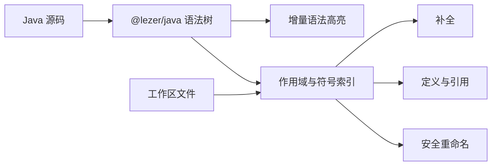

# 轻量 Java 语言服务

## 方案

本模块选择 `@lezer/java` 作为唯一 Java 解析依赖，并复用 `language:lezer` 的增量语法树与高亮会话。在语法树之上维护轻量的单文件作用域和工作区符号索引，再实现 `DynamicLanguageService`。



没有采用 `@codemirror/lang-java`，因为本项目不运行 CodeMirror 编辑器状态，其主要价值仍是对同一 Lezer parser 的封装；直接依赖 parser 可以避免无用包。也没有引入 JavaParser、JDT 或完整 LSP：它们能提供更精确的类型系统，却会显著增加下载体积、JS 启动成本和维护成本，不适合当前入门教学场景。

## 当前能力

- 语法高亮：支持完整解析、精确复用与增量语法树更新，协议位置均为 UTF-16 offset。
- 补全：支持 Java 关键字、当前词法作用域中的类型/字段/方法/参数/局部变量，以及常用教学 JDK 类型和成员。
- receiver 补全：支持工作区内可唯一解析的自定义类型、显式 import、同 package 类型和工作区继承链；为 `String`、集合、`Scanner`、`System.out` 等常见类型提供小型目录。
- 泛型：保留自定义类型实参，支持继承链代换、`extends`/`super` 通配符边界、泛型方法实参推断和形参上界校验。
- 重载与覆写：按参数数量、静态实参类型、引用继承层级、`null` 具体程度及常见基本类型拓宽选择唯一最佳声明；子类同签名方法遮蔽父类 override，参数不同的 overload 继续保留。
- 跳转、引用与重命名：支持作用域遮蔽、跨文件显式 import、同 package 类型和唯一成员。public 顶层类型重命名会同时返回源码编辑与 `Old.java → New.java` 文件重命名。
- 多文件缓存：同一服务实例按文件源码缓存语法树与语义索引，并在工作区文件移除后释放对应缓存。
- 文件图标：返回无需平台资源读取的 Java 咖啡杯 SVG 路径。

## 有意保留的边界

- 不加载 Android/JDK/Maven classpath，因此外部库只能补全内置目录中的常用成员，不能跳转到库源码。
- 不实现 javac 级目标类型推断、交叉类型捕获、访问控制、lambda overload 反向推断和流敏感类型收窄；无法唯一判定时返回 `null`。
- wildcard/static import、反射产生的成员以及运行时动态行为不做静态推断。
- 同名类型或同分重载无法唯一解析时返回 `null`，避免给出错误跳转或错误修改；重载方法的批量重命名仍保守拒绝。
- `@lezer/java` 当前语法版本不等同于最新 javac；新增 Java 语法应先通过解析测试确认后再声明支持。

这些限制不会影响变量、方法、类、继承、集合等入门教学的主要内容。若未来需要 Maven classpath、准确重载和完整泛型语义，应新增独立的 Java 编译服务，而不是继续扩张这层轻量索引。

## 成本判断

- 当前轻量方案：新增语言时主要维护语法树节点映射、少量内置成员目录和协议测试，包体核心只增加 Lezer Java grammar。
- 补齐更多教学 API：按类型扩展内置目录，成本低。
- 继续扩大目标类型推断、lambda 与通配符捕获：中高成本，需要引入表达式约束求解并补充大量歧义测试。
- 达到 javac/JDT 级语义：高成本，预计需要数周到数月并持续跟随 Java 版本，不建议在移动端 JS 包内自研。

## 本地验证

```shell
./gradlew :cyxbs-functions:code:language:java:jsNodeTest --no-configuration-cache
```

测试覆盖高亮与增量更新、UTF-16、词法作用域、内置及自定义 receiver 补全、跨文件 import、泛型传播与继承代换、通配符、泛型方法、重载/覆写、public 类型文件重命名，以及 KSP 生成的 JS dispatcher。

## 参考

- [Lezer Java](https://github.com/lezer-parser/java)
- [@lezer/java](https://www.npmjs.com/package/@lezer/java)
- [CodeMirror Java language support](https://github.com/codemirror/lang-java)
- [JavaParser](https://github.com/javaparser/javaparser)
