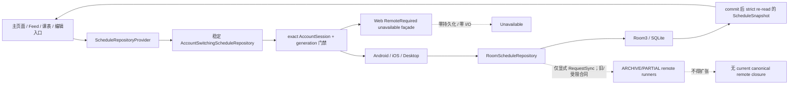
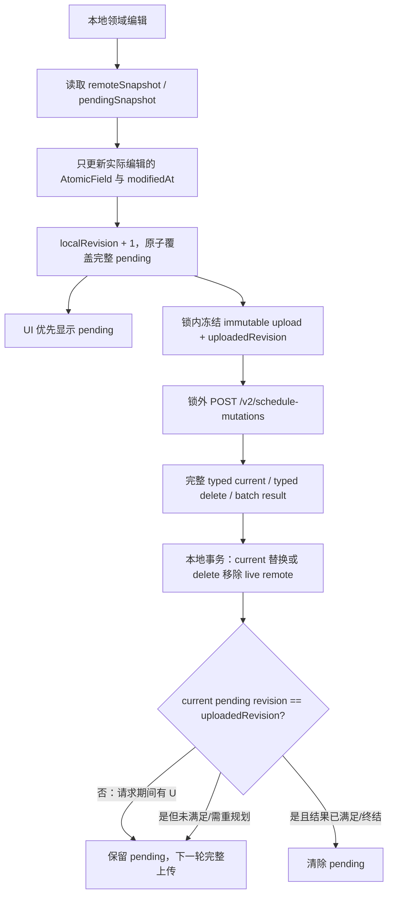

# Schedule v2 当前创建、更新与同步数据流

> [!CAUTION]
> **文档状态：ARCHIVE-ONLY。** 本文审计的单份 graph、legacy outbox、semantic command 与双向 Calendar 调用链均已从当前客户端删除。当前数据流以 [Codex 交接](./schedule-v2-codex-handoff.md) 和 [四表存储设计](./schedule-v2-platform-storage-upgrade.md) 为准；不得从本文恢复旧实现。
>
> canonical 远端事实源：
>
> 1. [完整资源 AtomicField 合并与原子批次](./schedule-v2-field-group-sync-design.md)
> 2. [双快照与 typed 资源版本同步流程](./schedule-v2-resource-version-sync-flow.md)
> 3. [重复日程单次覆盖与周期破坏能力矩阵](schedule-v2-recurrence-override-capability-matrix.md)
>
> 客户端迁移、旧表处置、平台切换和验收统一进入 [Schedule v2 Codex 交接](./schedule-v2-codex-handoff.md)。

---

## 1. 如何阅读本文

### 1.1 状态标签

| 标签 | 含义 |
| --- | --- |
| **ACTIVE** | 已进入当前客户端 production 组装或本地执行链。 |
| **PARTIAL** | 已有受限 source wiring 或显式调用方，但没有当前可用的端到端远端闭环。 |
| **ARCHIVE** | 已被 canonical 合同取代，只保留用于数据迁移、失败边界和历史审计。 |
| **TARGET** | canonical 客户端目标；当前 Kotlin/Room/Web 尚未完成。 |

### 1.2 事实源优先级

未来远端行为发生冲突时按以下顺序判断：

1. 三篇 canonical 文档；
2. 后端 `/Users/guoxiangrui/GolandProjects/magipoke-todo` 的 `guoxiangrui/schedule` checkout 与 `SCHEDULE_BACKEND_DESIGN.md`；
3. 当前客户端已提交代码，用于确认 active 本地行为和旧数据迁移输入；
4. 本文 ARCHIVE 章节；
5. `lane-03` W17 临时提交 `ff660779c36501f4a45993047b43166913bd5ccd`，只能作只读历史恢复与测试语料。

旧 Android 文档、Room schema、semantic test 或 lane diff 不能反向要求后端保留 command、cursor、receipt、status endpoint 或客户端 settlement history。

### 1.3 审计快照

| 范围 | 当前事实 | 判定 |
| --- | --- | --- |
| 客户端 checkout | 主工程为唯一 integration checkout：`guoxiangrui/feature/schedule`；D0 文档提交前基线 `a41208c454f1ca1e6027ee4a264f685852b96d60` | 已提交客户端仍是旧 graph/outbox/semantic 合同；本次只提交文档。 |
| Android remote path | 显式 `RequestSync` 已接受限 semantic runner | **PARTIAL**；后端旧 runtime 未部署，新 canonical wire 未接入。 |
| iOS/Desktop remote path | 仍构造 legacy mutation/read source consumer | **ARCHIVE/PARTIAL**；旧 endpoint/DTO 不能与 canonical 后端通信。 |
| Web | `RemoteRequiredScheduleRepository` unavailable façade；无 Schedule 持久化和网络 I/O | **ACTIVE fail-closed**；canonical Web gateway 未实现。 |
| 后端 checkout | `guoxiangrui/schedule` 已提交 complete typed resource、AtomicField、live-only confirmed、atomic batch、日常 Schedule 接口与统一 version 合同；尚未部署 | **TARGET backend source**；route 默认注册但不能写成线上可达。 |
| lane-03 | `guoxiangrui/feature/schedule_claude/w17-split-following-semantic-lifecycle` 已形成临时提交 `ff660779c36501f4a45993047b43166913bd5ccd`，working tree clean、未 push | **未集成**；只作历史恢复与测试语料，不得继续扩建或写成 current production。 |

---

## 2. 当前架构总览



### 2.1 平台分流

| 平台 | 当前 production delegate | 持久化 | 远端状态 |
| --- | --- | --- | --- |
| Android | `AccountSwitchingScheduleRepository → RoomScheduleRepository` | 进程级 Room3/SQLite | 受限 semantic `RequestSync` 为 **PARTIAL**；canonical 未接。 |
| iOS | 同上；数据库 owner 固定 Home 下 production DB | 进程级 Room3/SQLite；账号切换只重建 façade | legacy mutation/read consumer 为 **ARCHIVE/PARTIAL**；canonical 未接。 |
| Desktop | 同上；数据库 owner 固定 FileKit production DB | 进程级 Room3/SQLite | legacy mutation/read consumer 为 **ARCHIVE/PARTIAL**；canonical 未接。 |
| Web | `RemoteRequiredScheduleRepository` unavailable façade | 无 Schedule-owned durable persistence | **ACTIVE fail-closed**；无 canonical gateway。 |

`ScheduleRepositoryMutationMode` 仍负责 UI 门禁：`REMOTE_REQUIRED` 只有在可信 `Ready` 时允许业务 mutation；登出、游客、preparing binding 与切号空窗保持 `READ_ONLY`。Android/iOS/Desktop 的 `LOCAL_FIRST` 不因远端 unavailable 而回滚本地写。

### 2.2 账号与发布边界（ACTIVE）

`ScheduleRepositoryProvider` 暴露一个稳定的 `AccountSwitchingScheduleRepository`。账号变化不替换 UI 持有的 façade，而是按完整 `AccountSession` 创建新的 immutable delegate；同账号新 `generation` 也必须重建。

当前可靠边界：

- 命令入口同步 reconcile 当前权威 session；
- 初始化 pending/failure 时 mutation fail-closed；
- snapshot 和 calendar event 都经过 binding identity 检查；
- 旧账号或旧 generation 的迟到 publication 被拒绝；
- 代理转发 calendar event 前先发布该 delegate 的最新 snapshot；
- commit 后取消不等于未提交，后续必须重新 strict read；
- strict corruption 不降级为空快照。

这些边界与具体远端 wire 无关，应在 canonical 迁移中保留。

---

## 3. 当前本地数据流（ACTIVE）

### 3.1 创建与完整更新

```text
EditScheduleModelState / ScheduleDraft
→ ScheduleEditRouting
→ ScheduleCommand.Create / Update
→ exact-session RoomScheduleRepository
→ operationMutex
→ ScheduleRoomLocalCommandAdapter
→ 单个 ScheduleRoomStore writer transaction
→ strict graph/device identity read
→ ScheduleLocalCommandReducer
→ 完整 graph + legacy outbox/tombstone + semantic sidecar
→ generation compare-and-set + commit
→ transaction 外 strict re-read
→ snapshot / calendar event publication
```

当前语义：

- 正式 Category/Schedule ID 在本地提交前稳定生成；
- no-op 更新不写库；
- graph、owned child、旧 outbox/tombstone 与 generation 原子提交；
- reducer 是 Create/Update/Delete/Override/Split/Following 的单一领域归约源；
- 本地成功不会自动触发网络；
- 后端不可用不回滚 Android/iOS/Desktop 的本地事实；
- Web 不伪造本地成功。

详细流程见 [新增、更新与同步数据流](./schedule-v2-create-update-sync-flow.md)。

### 3.2 当前 durable graph

| artifact | 当前职责 | canonical 迁移判定 |
| --- | --- | --- |
| Schedule/Category/Override graph | UI 与本地领域事实 | 业务图可复用；版本、AtomicField 和 Override identity 需迁移。 |
| outbox | `QUEUED/IN_FLIGHT/DELIVERY_UNKNOWN` mutation history | **ARCHIVE**；不能直接当 pending snapshot。 |
| tombstone | 旧客户端删除保护和 receipt cleanup | **ARCHIVE**；服务端 canonical tombstone 才是远端删除事实。 |
| durable generation | 本地事务 CAS 与 publication 顺序 | 可保留为本地数据库 generation，不替代 `localRevision`。 |
| deviceId | 旧 mutation identity | 不属于 canonical resource merge 核心。 |
| sync cursor | 旧 bootstrap/delta 位置 | **ARCHIVE**；canonical 无 cursor。 |
| semantic checkpoint/fence | 旧 authoritative snapshot 位置和完整性 | **ARCHIVE**。 |
| K3 settlement | 旧 candidate terminal fact | **ARCHIVE**。 |
| K4 journal | 旧 immutable pre-submit request fact | **ARCHIVE**。 |
| K7 reservation | 旧 direct current-call submit permit | **ARCHIVE**。 |
| semantic intent/ref | 当前 direct command 与 retained outbox 的冻结关联 | 可用于旧行审计；不能直接成为 canonical pending。 |

当前 Room schema 没有 production `remoteSnapshot`、`pendingSnapshot` 或 `AtomicField` 模型。旧表数量和测试覆盖不构成复用义务。

### 3.3 当前 UI 到领域命令

| 用户场景 | 当前命令 | 当前本地目标 |
| --- | --- | --- |
| 新建 | `Create` | 新 Schedule + legacy CREATE outbox。 |
| 编辑整个日程/系列 | `Update` | 完整 graph replace + legacy PATCH outbox。 |
| 仅编辑此次 | `UpsertOccurrenceException` | ACTIVE `ScheduleOccurrenceException` + sparse patch。 |
| 此次及以后 | `SplitSeries` | 截断 A、创建 B、迁移后续 Override。 |
| 删除此次 | `UpsertOccurrenceException(CANCELLED)` | 保留 patch，抑制单次 occurrence。 |
| 恢复此次默认 | `DeleteOccurrenceException` | 物理删除 `ScheduleOccurrenceException` + 旧 mutation/tombstone 归约。 |
| 删除此次及以后 | `DeleteThisAndFollowing` | 首边界 whole delete；否则截断并删除后续 Override。 |
| 删除整个 Schedule | `Delete` | child-before-parent graph/outbox 归约。 |

这些命令名是本地 UI/领域 API，不是未来远端 command wire。

### 3.4 当前 recurrence/exception 模型

当前 `RecurrenceId`：

```text
scheduleId
+ originalDateTime（分钟精度）
+ timeZoneId
+ allDay
```

当前 `OccurrencePatch` 可覆盖 timing、title、description、category 和 reminders。改期不改变原始 `RecurrenceId`，因此 UI 可继续定位原始实例。

当前 UI 与本地 recurrence engine 保留完整 timing/category patch，但 canonical identity 统一为
`scheduleId + UTC occurrenceDate`；上传时把两者编码为独立 AtomicField，不把墙上时间、时区或全天标记并入 identity。
迁移与 adapter 仍必须明确区分：

- 可保留的本地显示/平台映射信息；
- 可上传的 canonical authority；
- 仅平台支持、不能反向扩展 canonical 的额外能力。

### 3.5 Snapshot 到 UI（ACTIVE）

所有消费者观察同一原子 `ScheduleSnapshot`，使用 bounded `[startInclusive, endExclusive)` 窗口由 common recurrence engine 展开：

- 主页面按自然日投影，Timed/AllDay 跨日拆片；
- Feed 从当前时间起取有限窗口，显式允许 Unscheduled；
- 课表按教学周投影，只保留 ACTIVE + Timed，并将 fragment 日期纳入稳定 identity；
- moved-in/moved-out 先应用 Override effective timing；
- occurrence identity 不从 UI 窗口、页码或拆片日期生成。

canonical 迁移不应破坏这些 UI 消费合同，但必须把“本地 effective occurrence”与“可同步的 canonical Override authority”分层。

---

## 4. 系统日历边界（ACTIVE，但不属于后端同步合同）

Android CalendarLink 和 iOS EventKit 已有独立 production 能力，但它们不能被用来推断服务端同步状态，也不能把平台字段写入 canonical resource：

| 子系统 | 当前事实 | 仍未完成 |
| --- | --- | --- |
| Android CalendarLink | 有界启动 reconciliation、finalized worker 的受限 outbound、进程存活期间 signal-only Provider observer、用户显式 conflict 观察/解决、普通删除本地 `DETACHED` | 可靠后台/进程死亡投递、完整自动冲突状态机、完整 BIDIRECTIONAL/Merge、真实后端多设备闭环。 |
| iOS EventKit | process-resident 单向 Schedule → EventKit runtime，Room 初始化 mutex 外 handoff | EventKit inbound、background/process-death reliability、occurrence exception、完整 conflict、真实 #282 full-access/真机验收。 |

系统日历的 link、event ref、calendar identifier、provider observation、conflict evidence 和 Settings cache 都是 adapter/private state，不是 Category/Schedule/OccurrenceOverride canonical wire 字段，也不是 `remoteSnapshot`。

详细事实以以下文档为准，本文不再复制数百行日历状态机：

- [Android 单向日历导出](./schedule-v2-calendar-export.md)
- [双向日历同步设计](./schedule-v2-calendar-bidirectional.md)
- [iOS EventKit](./schedule-v2-calendar-ios-eventkit.md)
- [动态 Workflow 执行手册](./schedule-v2-dynamic-workflow-runbook.md)

---

## 5. 当前远端链路审计

### 5.1 Android 受限 semantic runner（PARTIAL → ARCHIVE）

当前 Android normal façade 的显式 `RequestSync` 已接：

- durable outbox/tombstone 为空时的 old authoritative bootstrap；
- existing checkpoint 的单页 delta 与受限 reset fallback；
- pristine whole-Schedule DELETE；
- direct Category CREATE；
- intent/ref 严格授权的 effective Schedule CREATE；
- 携带旧 immutable `scheduleId + recurrenceId` 复合身份的 fixed-shape OccurrenceException UPSERT/DELETE；
- K4/K7 direct reservation 后单次 submit/confirmation；
- 五类 retained `DELIVERY_UNKNOWN`（Schedule DELETE、Category CREATE、Schedule CREATE、OccurrenceException UPSERT、OccurrenceException DELETE）的 K4 exact-load + 单次 status observation；
- accepted-changed 的 candidate-bound K3 settlement。

这些是已提交的旧合同 source wiring，但不能继续作为目标：

- 旧 semantic backend 未部署；
- canonical 后端不接 command/candidate/receipt/cursor/checkpoint，也不接旧 `recurrenceId` identity；
- generic recovery、K14 durable repoll、后台和 process-death continuation 未完成；
- lane-03 Split/Following 扩展已在 `ff660779c36501f4a45993047b43166913bd5ccd` 临时提交但未集成，production source 不应合入；
- 当前 Kotlin 模型没有 canonical AtomicField/remote/pending。

结论：保留其 exact-session、strict codec、锁外网络、取消、lost-return 和五类 retained UNKNOWN 测试经验；归档其全部远端状态机，不得从已提交旧 source wiring 继续扩建 canonical client。

### 5.2 iOS/Desktop legacy dispatcher（ARCHIVE/PARTIAL）

当前 iOS/Desktop 仍保留：

```text
显式 RequestSync
→ 短 claim transaction
→ 锁外 Ktor single-mutation dispatch
→ 短 receipt transaction
→ bootstrap / paged delta
→ graph + opaque cursor apply
```

旧结果 `Accepted/Rejected/DeliveryUnknown`、mutationId 重试、cursor cycle/reset、pending/tombstone 保护和 receipt cleanup 只描述旧客户端源码。过去后端已移除旧 mutation/bootstrap/sync route；当前 canonical 后端 working tree虽然重新使用 `/v2/schedule-mutations` 路径，但请求/响应完全不同且尚未部署。

因此 iOS/Desktop 当前 wiring 不能“等待后端上线后直接恢复”，必须替换 gateway、DTO、storage 和 settlement。

### 5.3 Web unavailable façade（ACTIVE fail-closed）

Web 当前：

- 无 Schedule-owned Room/Settings/IndexedDB/localStorage durable state；
- 无 outbox、device、candidate、cursor；
- 无网络 I/O；
- 不伪造 `Ready` 或“已保存”；
- `REMOTE_REQUIRED` 且非可信 Ready 时 UI 只读。

这是一条安全的当前边界，不是 canonical Web 实现。未来 Web 是否采用 page-lifetime 还是 durable pending 必须在 Codex handoff 中明确，并与 canonical remote/pending/compare-and-clear 合同一致。

### 5.4 同名 endpoint 的迁移陷阱

旧客户端和 canonical 后端都出现：

```text
POST /v2/schedule-mutations
```

旧客户端发送单条 generic mutation 并等待 receipt；canonical 后端接收三类 typed `confirmed/upserts/deletes` 与 `atomicBatches`，返回完整 typed current/tombstone。路径相同不代表 wire、幂等性或 settlement 兼容。

禁止只修改 base URL/path 常量后复用 `KtorScheduleMutationGateway`。

---

## 6. canonical 目标数据流（TARGET）



### 6.1 canonical resource

三类资源均为完整 typed object：

- `Category`：`name`、`color`、`sortOrder` 三个 AtomicField；
- `Schedule`：`title`、`description`、`categoryId`、`timing`、`recurrence`、`reminders`、`todoState`、
  `linkedToCourse` 八个 AtomicField，另有不可变 `kind`；
- `OccurrenceOverride`：`status`、`timing`、`title`、`description`、`categoryId`、`reminders` 六个 AtomicField。

每个 AtomicField 必须同时携带 `data` 和 `modifiedAt`。客户端上传完整资源，不上传字段 patch；未编辑原子保留原值和原时间。

服务端 metadata 与业务值分离：

```text
version（仅 live 资源）
remoteModifiedAt
AtomicField.modifiedAt
```

客户端另持有不上传的 `localRevision`。

### 6.2 双快照

每个 typed identity 最小本地状态：

```text
remoteSnapshot = 最后一次服务端完整 live resource
pendingSnapshot = 至多一份完整 UPSERT/DELETE 本地意图
```

规则：

- remote 只能由响应更新：完整 current 替换 live remote row，typed delete 删除对应 remote row；
- 本地不保存 tombstone snapshot，也不因响应缺席推断删除；
- pending UPSERT 是 UI 的 optimistic authority，pending DELETE 让 identity 本地不可见；
- 普通编辑覆盖完整 pending，不追加 mutation history；
- CREATE 使用 `version = 0`；
- DELETE pending 只能从当前 live remote 或 pending UPSERT 首次创建；identity 已本地缺失且无既存 DELETE pending 时，重复删除是本地幂等 no-op，不能合成 blind DELETE；
- PATCH 使用 remote 正版本；DELETE 始终只上传 typed identity 与 `localModifiedAt`，不依赖 live remote 是否仍存在；
- DELETE pending 一旦持久化，同 identity 不得转回 UPSERT；重新创建使用新 identity；
- 只有仍存在的 live remote 进入 `confirmed[]`，已删除 identity 不进入 confirmed；
- pending 和 confirmed 是两个维度，同 identity 可以同时存在 live confirmed 与 pending。

### 6.3 请求结构

```text
SyncRequest {
  syncRequestId
  categories { confirmed[]; upserts[]; deletes[] }
  schedules { confirmed[]; upserts[]; deletes[] }
  occurrenceOverrides { confirmed[]; upserts[]; deletes[] }
  atomicBatches[]
}
```

普通请求允许逐资源 mixed result；batch 内全部成功或全部回滚。服务端不会返回 cursor，也不会让客户端推断“响应缺席等于删除”。

### 6.4 响应 settlement 与 R→U

发送前冻结 `uploadedPending` 和 `uploadedRevision`。响应事务顺序固定：

1. 按 typed identity 汇总普通 result、atomic related 状态和 inventory delta；若存在 tombstone，直接按 delete-wins 删除对应 remote row；否则仅对 live observations 选择最高 `version`，完整 current 替换 `remoteSnapshot`，不保存本地 tombstone snapshot；同版本 live 冲突或 live 版本倒退时整次事务回滚；
2. 再比较当前 pending 的 `localRevision`；
3. revision 不同则保留 U；
4. revision 相同且结果已应用、满足或明确终结该 operation 时才清 pending；
5. CREATE 内容不同的 `ALREADY_EXISTS` 保留 pending，下一轮用返回的正版本转完整 PATCH；
6. REJECTED/related current/atomic-batch failure 保留 pending并重新规划。

同 revision 的终结码按 canonical 固定映射：UPSERT `CREATED/APPLIED/ALREADY_SATISFIED/SERVER_WON` 清理；`RESOURCE_DELETED` 应用 tombstone 后清理且不自动复活；DELETE `DELETED/ALREADY_DELETED` 清理；CREATE `ALREADY_EXISTS` 内容不同和所有 `REJECTED` 保留。batch 还要求 related 状态完整且所有 member revision 未变化。

客户端不保存 R/U 因果链，不做字段 rebase。服务端较新的未编辑原子在下一轮 LWW 中自然保留；U 真正编辑的原子以新 `modifiedAt` 重新竞争。`UPSERT R → DELETE U` 下一轮只上传 typed identity 与 `localModifiedAt`，不依赖 live remote 是否仍存在。`DELETE R → UPSERT U` 不复活同 identity，而是生成新 identity。

### 6.5 Override 与 recurrence 结构变化

canonical Override identity：

```text
scheduleId + occurrenceDate
occurrenceDate = UTC 午夜 date-slot
```

包含 status/timing/title/description/categoryId/reminders 六个原子。恢复默认写全部字段 INHERIT 的
neutral live Override，不发 DELETE。

以下必须使用 typed atomic batch：

- recurrence 日期集合变化；
- SplitSeries；
- DeleteThisAndFollowing；
- whole Schedule delete + Override closure；
- Override 跨 parent/date-slot 的 `DELETE old + CREATE new`。

客户端上传最终资源图，不上传 `SplitSeries` 或 `DeleteThisAndFollowing` 命令名。服务端在 staged graph 中验证 Category 引用、parent closure、recurrence membership 和 stable anchor history。同 identity recurrence 变化必须保留 WEEKLY anchor weekday，并在同一 atomic batch 中处理不再属于新规则的 live Override；当前不检测历史 tombstone date-slot 重入。

---

## 7. 当前到 canonical 的差距矩阵

| 层 | 当前事实 | canonical 目标 | 迁移动作 |
| --- | --- | --- | --- |
| 领域版本 | 单个 `revision` 混合本地/服务端含义 | server version + localRevision + AtomicField time | 拆分模型，禁止复用 revision 多义。 |
| Schedule 字段 | 普通值 + createdAt/updatedAt | 七个完整 AtomicField + server meta | 新同步模型与严格 mapper。 |
| Category | 普通 name/color/sortOrder + revision | `name`、`color`、`sortOrder` 三个 AtomicField | 新 typed model。 |
| Override identity | original wall time + zone + allDay | scheduleId + UTC occurrenceDate | Room/UI/wire identity 迁移。 |
| Override fields | timing/title/description/category/reminders | status/timing/title/description/categoryId/reminders | 保留原 date-slot identity，并补齐 status 与六原子映射。 |
| 恢复默认 | 物理 DELETE Override | neutral live Override | 修改命令、UI 和 storage。 |
| recurrence | 当前可表达 MONTHLY/YEARLY；无稳定 anchor history | 当前后端受限 DAILY/WEEKLY + stable UTC anchor history | unsupported fail-closed；持久化 anchor。 |
| reminder | 本地 stable ID/channel | wire 完整列表原子 | 明确无损/有损映射。 |
| 时间 | 本地墙钟、IANA zone、MinuteTime | signed int64 Unix millis + UTC date-slot | 严格范围/时区 mapper。 |
| 本地 optimistic state | graph + mutation queue | remote/pending 双快照 | 新 Room schema。 |
| 并发控制 | base revision CAS、receipt、cursor | per-field LWW + compare-and-clear | 删除旧 settlement/rebase。 |
| 远端 inventory | opaque cursor/checkpoint | live-only typed confirmed[] | 不迁移 cursor。 |
| 结构变化 | 本地命令 + 多条 outbox/semantic lifecycle | typed atomic batch 最终图 | planner 输出重构。 |
| 后端返回 | receipt / authoritative page | 完整 current resource / typed delete | 全新 response applier：current 替换 live remote row，delete 删除 remote row。 |
| Web | unavailable、无持久化 | 明确 page-lifetime 或 durable 双快照策略 | handoff 决策后实现。 |
| 系统日历 | adapter/link/private cache | 与 canonical resource 解耦 | 只通过领域 mapper 交互。 |

---

## 8. 可以复用与必须删除的边界

### 8.1 可以复用

- stable repository façade；
- exact `AccountSession`/generation/scope/owner fences；
- local-first UX；
- reducer 的领域校验与完整目标图；
- 单 SQLite writer transaction；
- commit 后 strict re-read；
- stable client-generated IDs；
- child-before-parent dependency closure；
- first-boundary following delete 归约；
- SplitSeries 的 A/B/Override 最终业务语义；
- strict codec、取消、lost-return 和账号副作用测试方法；
- UI snapshot projection 与系统日历 adapter 隔离。

### 8.2 不得继续实现或伪装兼容

- semantic command wire；
- candidate ID / receipt / status observation；
- authoritative cursor、checkpoint、high-water、fence；
- K3/K4/K7/K13/K14 远端生命周期；
- command intent/ref 作为未来 submit authority；
- legacy `PendingMutationRecord` claim/dispatch/receipt；
- `DELIVERY_UNKNOWN` 作为新协议 durable state；
- client tombstone 作为服务端删除事实；
- generic `ResourceKind + nullable payload` wire；
- `ScheduleSnapshotMerger` 的旧 revision/cursor 合并；
- lane-03 W17 successor candidate 生命周期。

---

## 9. 提交历史与 lane-03 结论

| 提交 | 已提交事实 | 对当前迁移的意义 |
| --- | --- | --- |
| `5ec643e11` | local-first 架构 | 保留本地优先和账号隔离。 |
| `a1a343beb` | 本地 reducer | 保留领域归约。 |
| `57500741b` | 统一旧 mutation endpoint 路径 | 同名 URL 不能证明新协议兼容。 |
| `5042f26f7` | Android semantic bootstrap | cursor/checkpoint 归档。 |
| `4178c3ade` | 单条 DELETE semantic drain | 删除 closure 场景可转 canonical 测试。 |
| `8a1c3e53f` | Category CREATE semantic drain | Create 场景可转 typed resource 测试。 |
| `f636baff0` | Schedule CREATE semantic drain | R→U/Create lost-return 场景可转双快照测试。 |
| `3e54ec112` | UNKNOWN 单次状态确认 | status/receipt recovery 归档。 |
| `1591ef0bb` | authoritative 单页 delta | old delta/cursor 归档。 |
| `804e0bf49` | following 首次边界语义修正 | whole-delete 领域语义继续有效。 |

`lane-03` W17 已在分支 `guoxiangrui/feature/schedule_claude/w17-split-following-semantic-lifecycle` 原样形成临时提交 `ff660779c36501f4a45993047b43166913bd5ccd`，工作树 clean、未 push、未集成。该历史实现为 Split/Following 增加 root/successor candidate、K4/K7/status/K3、ordered refs、authority revision 和 unknown 分组，production source 不应合入。唯一值得迁移的是业务场景、测试语料和 reducer 最终图；其所有 command-specific durable lifecycle 都由 typed atomic batch 取代。

---

## 10. 当前代码地图

| 路径 | 当前责任 | 状态 |
| --- | --- | --- |
| `domain/repository/ScheduleRepository.kt` | 命令、mutation mode 与稳定 repository 合同 | **ACTIVE**；远端实现需换。 |
| `data/repository/v2/AccountSwitchingScheduleRepository.kt` | exact-session delegate 与 publication 隔离 | **ACTIVE，可复用**。 |
| `data/repository/v2/ScheduleLocalCommandReducer.kt` | 本地完整目标 graph 与 operation plan | **ACTIVE，可复用领域规则**。 |
| `data/local/room3/ScheduleRoomLocalCommandAdapter.kt` | 单事务 strict read/replay/CAS | **ACTIVE，可复用事务骨架**。 |
| `data/local/room3/ScheduleRoomEntities.kt` | 当前 graph 与旧 remote artifacts | graph active；remote artifacts **ARCHIVE**。 |
| `data/local/room3/RoomScheduleRepository.kt` | noWeb account-bound façade、strict re-read、publication | **ACTIVE**；sync delegate 需替换。 |
| `data/local/room3/ScheduleRoomSemanticBootstrapSyncRunner.kt` | Android 旧 semantic bootstrap/drain/status | **PARTIAL → ARCHIVE**。 |
| `data/local/room3/ScheduleRoomRemoteSyncRunner.kt` | iOS/Desktop 旧 bootstrap/delta consumer | **ARCHIVE/PARTIAL**。 |
| `data/local/room3/ScheduleRoomOutboxDispatcher.kt` | 旧 claim/dispatch/receipt | **ARCHIVE**。 |
| `data/remote/semantic/**` | 旧 command/cursor/receipt client | **ARCHIVE**。 |
| `data/remote/v2/KtorScheduleMutationGateway.kt` | 旧同名 endpoint single-mutation gateway | **ARCHIVE，不能复用 wire**。 |
| `domain/model/ScheduleModels.kt` | 当前本地 Schedule/Category/Override 模型 | ACTIVE；同步字段/identity 需重构。 |
| `domain/repository/ProductionScheduleRepositoryFactory.*.kt` | 平台分流 | ACTIVE；最后显式 cutover。 |

---

## 11. Codex handoff 必须覆盖

[Schedule v2 Codex 交接](./schedule-v2-codex-handoff.md) 至少需要形成以下可执行任务：

1. Kotlin 与 Go canonical wire 的冻结、strict corpus 和互操作；
2. Category/Schedule/OccurrenceOverride AtomicField 模型；
3. remote/pending 双快照 Room schema、`localRevision` 和 compare-and-clear；
4. 旧 graph 与新同步模型的单一事实源选择，禁止长期双写两套远端状态机；
5. 旧 outbox/tombstone/cursor/semantic rows 的 quarantine、迁移或清理策略；
6. UTC occurrenceDate、anchor history 和 unsupported recurrence fail-closed；
7. neutral live Override 与 THIS_ONLY UI 能力收口；
8. typed ordinary request 和 atomic batch planner；
9. Android/iOS/Desktop/Web production factory 的分阶段 cutover；
10. 后端实际部署、真实账号网络、数据库和跨端 acceptance；
11. 系统日历 adapter 与 canonical remote state 的隔离回归；
12. rollback：新 gateway/schema/cutover 必须能独立回退，不能重新激活旧 submit authority。

最低验证矩阵：

- CREATE、PATCH、DELETE 的 live-only confirmed 构造；
- 请求期间 R→U；
- response lost-return 后同 identity 重试；
- 不同字段和相同字段的多设备 LWW；
- equal modifiedAt 同值/异值；
- compare-and-clear 不误删较新 pending；
- tombstone 不可复活；
- neutral Override 可再次编辑；
- recurrence membership 与 stable anchor；
- split/following/closure atomic batch 整体回滚；
- ordinary mixed result；
- exact-session 切号、取消和 response publication fence；
- SQLite commit 后取消、重开和 migration；
- Android/iOS/Desktop/Web 与当前 Go backend 的 strict wire interop。

---

## 12. 验证证据边界

当前已有大量 Desktop bundled-SQLite、common reducer、recurrence engine、Android host/fake Calendar、codec 和 compile 测试，它们证明当前本地事务与旧 source contract 的若干边界。它们不证明：

- canonical Kotlin wire 已实现；
- remote/pending schema 已迁移；
- 当前后端 working tree 已提交或部署；
- 真实 MySQL、账号、网络或多设备互操作已通过；
- Android/iOS 真机系统日历验收已完成；
- Web 已有 remote consumer；
- lane-03 W17 已集成。

迁移后的 acceptance 必须重新围绕 canonical typed resource 和双快照建立，不能把旧 command/cursor/receipt 测试数量作为兼容结论。

---

## 13. 一句话总结

> **当前可信事实是 local-first Room graph、exact-session 隔离、单事务 reducer 和 strict snapshot publication；当前所有 command/cursor/receipt/bootstrap/settlement 远端路径都只剩 PARTIAL/ARCHIVE 价值。下一阶段必须按 canonical complete typed resource、AtomicField、live-only confirmed、remote/pending 双快照、localRevision compare-and-clear 与 typed atomic batch 重建客户端远端同步。**
